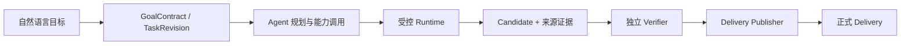

<h1 align="center">Mangrove（红树林）</h1>

<p align="center">
  <strong>把自然语言数据目标，变成可验证、可追溯、可正式交付的任务。</strong>
</p>

<p align="center">
  <a href="./docs/status/current.md"></a>
  
  
  
  
  <a href="./LICENSE"></a>
</p>

<p align="center">
  在线 / 离线 · 公域 / 私域 · 结构化 / 非结构化
</p>

<p align="center">
  <a href="#快速开始">快速开始</a> ·
  <a href="#当前仓库具备什么能力">能力概览</a> ·
  <a href="#从目标到正式交付">任务链路</a> ·
  <a href="#开发与验证">开发验证</a> ·
  <a href="#文档与社区">文档与社区</a>
</p>

---

Mangrove 是一个统一数据任务平台。用户描述目标，平台负责来源获取、任务规划、受控能力调用、
数据处理、证据绑定、独立验证和正式交付，让数据工程师与业务开发者把精力集中在数据应用和
价值创造上。

> [!IMPORTANT]
> 当前 `main` 是公开开发基线，不是稳定生产版本，也不代表 Phase 4 已完成或已创建 `v0.0.8`
> 标签。能力状态、验收阶段和未完成门禁只以
> [`docs/status/current.md`](docs/status/current.md) 为准。

> [!NOTE]
> 企业 API、业务系统、本地路径、对象存储、远程 MCP、普通用户平台能力开放、完整 PG-05
> 和 Linux/多人生产门仍在规划或后续验证中。

## 当前仓库具备什么能力

| 能力 | 当前状态 | 边界 |
| --- | --- | --- |
| 公域互联网采集 | **可用** | 支持自然语言理解、规划、采集、清洗、分析和结果输出 |
| 正式数据工作台 | **可用** | `/data-prep` 支持不可变 revision、取消、版本、来源、结果预览和回收站 |
| 本地文件处理 | **可用** | 覆盖 PDF、Word、Excel、CSV 等代表文件主链 |
| 11 种交付预览 | **工程验证** | 表格与文档格式统一预览；TSV 尚不是界面正式交付格式 |
| Delivery Publisher | **工程验证** | 只有独立验证、完整性和 QA 通过的 Candidate 才能形成正式 Delivery |
| 覆盖感知文档检索 | **代表任务验证** | 按目标发现与精读，由独立 Verifier 判断覆盖与停止 |
| 多模型连接 | **工程实现** | 支持个人/平台连接、Preset、自定义/LAN、Key 隔离和 revision 冻结 |
| Agentic Capability | **管理员灰度** | Python Tool、stdio MCP、Capability Host、验证运行、供应链证据、个人能力自动晋级、管理员审核/审计查看与平台快照发布机制（admin_gray）；默认关闭 |

平台明确区分 Candidate、验证通过和正式 Delivery：只有 `delivery_published` 且通过完整性与
QA 的 `output_id` 才能作为面向用户的正式结果。

## 从目标到正式交付



权限、Owner、来源快照、能力 digest、证据、覆盖、预算、停止、发布和资源清理由确定性门控制；
Agent 可以动态选择路线，但不能绕过这些边界。

## 快速开始

### 1. 准备环境

```powershell
Copy-Item .env.example .env
py -3.13 -X utf8 -m pip install -r requirements.txt

Set-Location frontend
npm install
npm run build
Set-Location ..
```

按需在 `.env` 中配置模型与采集账号。真实凭据、Cookie、数据库、日志和任务制品不得提交。

### 2. 启动统一入口

```powershell
py -3.13 -X utf8 scripts/dev_reload.py
```

打开 <http://localhost:8088>，按 `Ctrl+C` 停止服务。启动失败时先检查
`logs/dev_reload.log`。

> [!TIP]
> `http://localhost:5173` 只用于前端热更新，不是统一产品入口。需要前端开发服务时，在第二个
> 终端进入 `frontend/` 后运行 `npm run dev -- --host 0.0.0.0`。

### 3. 按需准备采集组件

```powershell
powershell.exe -NoProfile -ExecutionPolicy Bypass `
  -File scripts/setup_external_dependencies.ps1
```

该脚本会获取固定上游提交并应用仓库内审核过的补丁。未准备可选组件时，相应网页或社媒采集
能力不可用，但不影响本地文件处理主链。

## 开发与验证

### 技术栈

`Python 3.13` · `FastAPI` · `React` · `Vite` · `TypeScript` · `SQLite` · `Docker Desktop`

Docker Desktop 用于 Pi Runtime、Capability Host 与隔离验证。维护者本机的一键启停脚本包含
本地解释器、局域网和服务编排配置，因此不随公开仓库发布。

### 安装测试依赖

```powershell
py -3.13 -X utf8 -m pip install -r requirements.txt
py -3.13 -X utf8 -m playwright install chromium
```

### 运行门禁

```powershell
py -3.13 -X utf8 -m pytest

Set-Location frontend
npm run build
npm run test:e2e
```

完整测试可能调用 Docker、OCR、本地模型或真实样例。应按当前工单风险选择最小充分门禁，
并保留可重复的测试源码；生成物可用 `scripts/clean_generated_artifacts.ps1` 清理。自动化测试
通过不等于用户验收或生产资格。

## 可选第三方组件

| 组件 | 用途 | 许可边界 |
| --- | --- | --- |
| [MediaCrawler](https://github.com/NanmiCoder/MediaCrawler) | 社媒采集 | 仅限其许可证允许的非商业学习与研究 |
| [Firecrawl](https://github.com/firecrawl/firecrawl) | 网页采集 | AGPL-3.0 |

第三方源码副本不直接提交到 Mangrove。固定来源、版本、补丁和完整许可证边界参见
[`external/README.md`](external/README.md) 与
[`THIRD_PARTY_NOTICES.md`](THIRD_PARTY_NOTICES.md)。

## 文档与社区

| 使用与状态 | 架构与工程 | 社区与安全 |
| --- | --- | --- |
| [当前状态](docs/status/current.md)<br>[当前交接](handoff.md) | [领域词汇](CONTEXT.md)<br>[ADR 索引](docs/adr/README.md)<br>[工程规则](AGENTS.md)<br>[Agent 协作](docs/agents/) | [参与贡献](CONTRIBUTING.md)<br>[行为准则](CODE_OF_CONDUCT.md)<br>[安全策略](SECURITY.md)<br>[第三方许可](THIRD_PARTY_NOTICES.md) |

## 数据与安全

- `.env`、本地 Agent 设置、审计数据、运行数据库、上传文件、浏览器登录态和任务制品不得提交。
- `data/lessons/`、`data/templates/` 和 `memory/` 中的运行学习结果或个人偏好默认只保存在本机。
- 不要整体删除 `data/`、`downloads/` 或外部采集器的浏览器登录态。
- 外部发布、数据外发、权限扩大、凭据处理和不可逆删除均需要人工确认。

发现安全问题时，请阅读 [`SECURITY.md`](SECURITY.md) 并使用 GitHub 私密漏洞报告；不要在
公开 Issue、Discussion、PR 或日志中披露漏洞细节、用户数据或凭据。

## 参与和许可

欢迎通过 [`CONTRIBUTING.md`](CONTRIBUTING.md) 了解开发约定，并遵守
[`CODE_OF_CONDUCT.md`](CODE_OF_CONDUCT.md)。Mangrove 自有代码采用
[`MIT License`](LICENSE)；所有第三方组件继续遵循各自许可证。
