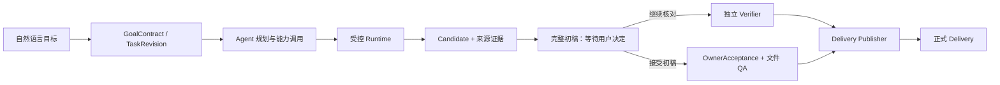

<h1 align="center">Mangrove（红树林）</h1>

<p align="center">
  <strong>把自然语言数据目标，变成可验证、可追溯、可正式交付的任务。</strong>
</p>

<p align="center">
  <a href="./docs/status/current.md"></a>
  
  
  
  
  <a href="./LICENSE"></a>
</p>

<p align="center">
  在线 / 离线 · 公域 / 私域 · 结构化 / 非结构化
</p>

<p align="center">
  <a href="#快速开始">快速开始</a> ·
  <a href="#当前仓库具备什么能力">能力概览</a> ·
  <a href="#从目标到正式交付">任务链路</a> ·
  <a href="#开发与验证">开发验证</a> ·
  <a href="#文档与社区">文档与社区</a>
</p>

---

Mangrove 是一个统一数据任务平台。用户描述目标，平台负责来源获取、任务规划、受控能力调用、
数据处理、证据绑定、结果核对和正式交付，让数据工程师与业务开发者把精力集中在数据应用和
价值创造上。

> [!IMPORTANT]
> 当前 `main` 是公开开发基线，不是稳定生产版本，也不代表 Phase 4 已完成或已创建 `v0.0.8`
> 标签。能力状态、验收阶段和未完成门禁只以
> [`docs/status/current.md`](docs/status/current.md) 为准。

> [!WARNING]
> 当前开发快照与 `main` 存在同号不同内容的数据库迁移，不能直接用于 `main` 既有实例的升级。
> 合并前须完成迁移兼容设计及副本演练，不能通过改写已执行迁移或覆盖原库解决。详见当前状态台账。

> [!NOTE]
> 企业 API、业务系统、本地路径、对象存储、远程 MCP、普通用户平台能力开放和目标
> Linux/多人生产门仍在规划或后续验证中。G2 的完整 PG-05 已有工程与代表任务证据，但不
> 等于上述部署、受众开放或稳定 Release 已完成。

## 当前仓库具备什么能力

以下说明对应当前检出的开发代码，不代表所有开发分支均已合入 `main`，也不等于完成生产验收。

| 能力 | 当前状态 | 边界 |
| --- | --- | --- |
| 公域互联网采集 | **可用** | 支持自然语言理解、规划、采集、清洗、分析和结果输出 |
| 正式数据工作台 | **可用** | `/data-prep` 支持不可变 revision、取消、版本、来源、结果预览和回收站 |
| 本地文件处理 | **可用** | 覆盖 PDF、Word、Excel、CSV 等代表文件主链 |
| 11 种交付预览 | **工程验证** | 表格与文档格式统一预览；TSV 尚不是界面正式交付格式 |
| 初稿与正式交付 | **工程验证** | Pi 完整初稿生成后等待用户决定；可接受初稿或继续核对。两条路径都经唯一 Publisher，用户接受不冒充系统验证通过 |
| 覆盖感知文档检索 | **代表任务验证** | 按目标发现与精读，由独立 Verifier 判断覆盖与停止 |
| 多模型连接 | **工程实现** | 支持个人/平台连接、Preset、自定义/LAN、Key 隔离和 revision 冻结 |
| 自动化任务 | **工程验证** | 自然语言或手动创建计划、绑定执行模型、查看运行记录与结果；通知需明确授权，旧计划的未知时区需重新确认 |
| 模板库与教训库 | **工程验证** | 同类任务自动参考已积累的方法与教训；个人默认私有，共享须确认，巡检按角色开放 |
| 记忆 | **工程验证** | 管理个人偏好、对话中记住或忘记、后续任务召回；全局规范由获授权角色维护，当前任务要求优先 |
| 运营审计与 Token | **工程验证** | 按权限查看使用情况和操作记录；按用户/模型统计用量、筛选和导出。中国区参考价格可配置，本地模型仅统计 Token |
| 反馈与用户管理 | **工程验证** | 点赞记录保留，只有点踩进入处理流程；查看原任务正文须走原因说明与审计，账号操作遵循角色层级 |
| 按角色的新手教程 | **工程验证** | 首次进入自动播放，可跳过、随时重播；用户/角色/页面分别保存，仅当前浏览器持久化，不替代接口权限检查 |
| Agentic Capability | **两条真实纵切面已验证** | Python Tool 与 Everything MCP 均完成个人验证→晋级 verified→脱敏快照→签名→admin_gray 发布→真实装载→完整治理动作链（#15/#16 真实执行，AC-07 主线 #9-#17 全部关闭）；受众固定 admin_gray，未开放普通用户 |

平台明确区分初稿、系统验证通过、用户接受和正式 Delivery：只有 `delivery_published` 且通过
完整性与文件 QA 的 `output_id` 才是正式结果。用户接受只代表业务采纳，不表示准确性已经系统确认。

## 从目标到正式交付



权限、Owner、来源快照、能力 digest、证据、覆盖、预算、停止、发布和资源清理由确定性门控制；
Agent 可以动态选择路线，但不能绕过这些边界。

初稿暂停适用于具备初稿能力的 Pi 工作台链路；其他运行路线不会伪造暂停或接受状态。
“继续核对”恢复原执行身份；缺少恢复会话时拒绝静默重做。详见
[用户决定后续核对](docs/adr/0047-owner-controlled-draft-verification.md)。

## 常用功能提示

- 页面右上角“新手教程”可重新播放当前页面引导；完成或跳过后不再自动打扰。清除站点数据、
  更换浏览器或设备会重新播放，角色改变则使用该角色的独立进度。
- 记忆保存长期偏好，模板库积累处理方法；任务中的本次要求优先，无需为每个任务重新配置。
- 反馈管理的“待处理”只统计尚未处理的点踩；点踩率为全平台点踩数除以全平台任务数。
- Token 统计来自调用记录，不将历史未知用量补成零。参考成本不是账单；本地模型不计价，
  缺少匹配中国区报价的云模型显示未计价。价格与更新方法见
  [分用户用量说明](docs/plans/2026-09-19-token-usage.md)。
- 新记录和计划使用北京时间；无时区历史记录保留原值并明确标注，不猜测转换。

## 快速开始

### 1. 准备环境

```powershell
Copy-Item .env.example .env
py -3.13 -X utf8 -m pip install `
  -r requirements.txt `
  -r requirements-collectors.txt

Set-Location frontend
npm ci
npm run build
Set-Location ..
```

按需在 `.env` 中配置模型与采集账号。真实凭据、Cookie、数据库、日志和任务制品不得提交。
`JWT_SECRET` 必须显式配置为至少 32 字节的随机值；缺失、过短或使用默认/示例值时网关拒绝启动。
已有实例不要自动更换密钥；若数据库连接凭据依赖 JWT 密钥派生，须先规划兼容与受控轮换。

### 2. 显式初始化数据库

Mangrove 自有 Schema 只通过中央迁移命令变更。首次启动和升级既有数据库前，都先查看状态并
使用唯一备份名显式迁移：

```powershell
New-Item -ItemType Directory -Force data/backups | Out-Null
$migrationStamp = Get-Date -Format yyyyMMdd-HHmmss

py -3.13 -X utf8 -m src.database_migrations status `
  --profile webui --database data/webui.db
py -3.13 -X utf8 -m src.database_migrations apply `
  --profile webui --database data/webui.db `
  --backup "data/backups/webui-before-$migrationStamp.db"

py -3.13 -X utf8 -m src.database_migrations status `
  --profile scheduler --database data/scheduler.db
py -3.13 -X utf8 -m src.database_migrations apply `
  --profile scheduler --database data/scheduler.db `
  --backup "data/backups/scheduler-before-$migrationStamp.db"
```

`apply` 会生成备份、SHA 和 Receipt；服务启动只验证 Schema，不会静默迁移。不要覆盖既有备份。
真实生产数据库迁移、恢复覆盖、旧备份处置和 Secret/Key 轮换不属于快速开始动作。

### 3. 启动统一入口

新实例在数据库迁移完成后，由维护者在交互终端显式初始化管理员：

```powershell
py -3.13 -X utf8 -m src.api.bootstrap_admin --database data/webui.db --username maintainer
```

命令隐藏输入并确认至少 12 位密码，不接收命令行密码，不迁移 Schema；并发初始化只能成功一次。
已有超级管理员时拒绝重建，不修改已有账号。已初始化实例直接跳过此步骤。
公开注册默认关闭；管理员开启后，自助注册也只创建待审批普通用户。

随后启动网关，使用初始化的管理员账号登录：

```powershell
py -3.13 -X utf8 scripts/dev_reload.py
```

打开 <http://localhost:8088>，按 `Ctrl+C` 停止服务。启动失败时先检查
`logs/dev_reload.log`。

平台登录使用 HttpOnly Cookie：访问权限最长 30 分钟，可轮换续期，一次登录绝对期限为 7 天。
“我的设置 → 登录与密码”可修改密码或退出所有设备；退出不取消后台任务。非环回访问须使用
HTTPS；浏览器需支持 Web Locks，以协调同一浏览器多个标签页的刷新。刷新结果未知时重新登录。
旧 Bearer 凭证不再接受；升级到 `webui_0011` 后需重新登录，已有实例迁移仍须独立维护窗口和备份。
脚本请求须保留 Cookie，并为写请求提供同源 `Origin` 与 `X-Mangrove-CSRF: 1`；登录响应不返回凭证。

> [!TIP]
> `http://localhost:5173` 只用于前端热更新，不是统一产品入口。需要前端开发服务时，在第二个
> 终端进入 `frontend/` 后运行 `npm run dev -- --host 0.0.0.0`。

### 4. 按需准备采集组件

```powershell
powershell.exe -NoProfile -ExecutionPolicy Bypass `
  -File scripts/setup_external_dependencies.ps1
```

该脚本会获取固定上游提交并应用仓库内审核过的补丁。未准备可选组件时，相应网页或社媒采集
能力不可用，但不影响本地文件处理主链。

## 开发与验证

### 技术栈

`Python 3.13` · `FastAPI` · `React` · `Vite` · `TypeScript` · `SQLite` · `Docker Desktop`

Docker Desktop 用于 Pi Runtime、Capability Host 与隔离验证。维护者本机的一键启停脚本包含
本地解释器、局域网和服务编排配置，因此不随公开仓库发布。

### 安装测试依赖

```powershell
py -3.13 -X utf8 -m pip install `
  -r requirements.txt `
  -r requirements-collectors.txt `
  -r requirements-dev.txt
py -3.13 -X utf8 -m playwright install chromium
```

离线评测另加 `-r requirements-evaluation.txt`。`requirements-gpu.txt` 当前是有意为空的
overlay：项目没有进程内 GPU workload，不应从历史开发机复制 CUDA/Triton pin。

### 运行门禁

```powershell
py -3.13 -X utf8 scripts/ci/check_requirement_consistency.py `
  --base requirements.txt `
  --base requirements-collectors.txt `
  --base requirements-dev.txt `
  --base requirements-evaluation.txt `
  --base requirements-gpu.txt `
  --subset requirements-ci.txt
py -3.13 -X utf8 scripts/ci/check_utf8.py
py -3.13 -X utf8 -m pytest tests/test_ci_contract.py `
  tests/test_data_prep_contracts.py tests/test_candidate_verification_migration.py

Set-Location frontend
npm ci
npm run build
```

GitHub 的 `minimum-ci` 还会用固定版本 Gitleaks 扫描完整提交历史，并上传脱敏日志、JSON 与
JUnit 证据。`heavy-ci-manual` 只能由维护者人工选择完整回归、G1 冻结契约、五组依赖干净安装
或 Docker 构建；真实样例、外部模型、生产迁移和 Secret 继续走独立人工授权门，任何 CI 都不
读取生产 Secret。
`main` 由 active Ruleset 强制 PR、讨论解决、strict `backend-fast` / `frontend-build` /
`secret-scan` 和禁止强推，且没有 bypass。当前仓库只有一名维护者，经明确决策审批数为 0；
这不代表已有独立人工审查，未来加入第二位维护者后应另行提升并复验审批门。
详细分层见 `CONTRIBUTING.md`。自动化测试通过不等于用户验收或生产资格。

本轮模块回归的入口和隔离验证方式见 [当前交接](handoff.md) 与
[新手引导规格](docs/plans/2026-09-20-role-onboarding.md)。真实模型探针不属于默认回归，
不得在没有数据外发与费用授权时执行。概览品牌图片是可选本机资源，公开代码在缺图时使用通用图标。

## 可选第三方组件

| 组件 | 用途 | 许可边界 |
| --- | --- | --- |
| [MediaCrawler](https://github.com/NanmiCoder/MediaCrawler) | 社媒采集 | 仅限其许可证允许的非商业学习与研究 |
| [Firecrawl](https://github.com/firecrawl/firecrawl) | 网页采集 | AGPL-3.0 |

第三方源码副本不直接提交到 Mangrove。固定来源、版本、补丁和完整许可证边界参见
[`external/README.md`](external/README.md) 与
[`THIRD_PARTY_NOTICES.md`](THIRD_PARTY_NOTICES.md)。

## 文档与社区

| 使用与状态 | 架构与工程 | 社区与安全 |
| --- | --- | --- |
| [当前状态](docs/status/current.md)<br>[当前交接](handoff.md) | [领域词汇](CONTEXT.md)<br>[ADR 索引](docs/adr/README.md)<br>[工程规则](AGENTS.md)<br>[Agent 协作](docs/agents/) | [参与贡献](CONTRIBUTING.md)<br>[行为准则](CODE_OF_CONDUCT.md)<br>[安全策略](SECURITY.md)<br>[第三方许可](THIRD_PARTY_NOTICES.md) |

## 数据与安全

- `.env`、本地 Agent 设置、审计数据、运行数据库、上传文件、浏览器登录态和任务制品不得提交。
- `data/lessons/`、`data/templates/` 和 `memory/` 中的运行学习结果或个人偏好默认只保存在本机。
- 不要整体删除 `data/`、`downloads/` 或外部采集器的浏览器登录态。
- 外部发布、数据外发、权限扩大、凭据处理和不可逆删除均需要人工确认。
- Mangrove 自有数据库结构只通过 `src.database_migrations` 显式迁移；应用启动只验证版本并在
  不兼容时失败关闭。
- 配置中心标记为 `secret=True` 的值只在业务表保存 Owner/配置键绑定的 SecretRef，原值由共享
  Vault 密文边界持有。副本迁移通过不代表生产原库已经迁移，也不授权轮换或销毁密钥。

发现安全问题时，请阅读 [`SECURITY.md`](SECURITY.md) 并使用 GitHub 私密漏洞报告；不要在
公开 Issue、Discussion、PR 或日志中披露漏洞细节、用户数据或凭据。

## 参与和许可

欢迎通过 [`CONTRIBUTING.md`](CONTRIBUTING.md) 了解开发约定，并遵守
[`CODE_OF_CONDUCT.md`](CODE_OF_CONDUCT.md)。Mangrove 自有代码采用
[`MIT License`](LICENSE)；所有第三方组件继续遵循各自许可证。
