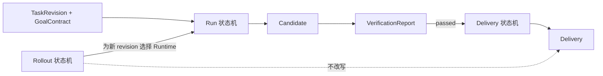
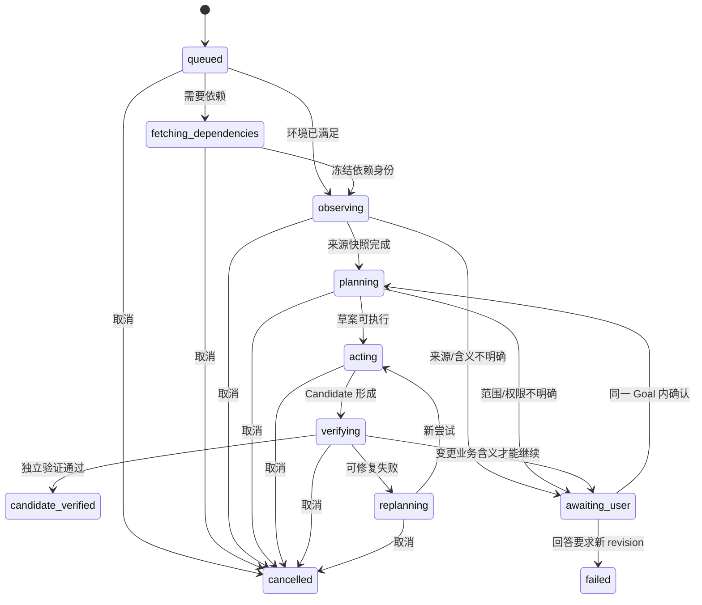
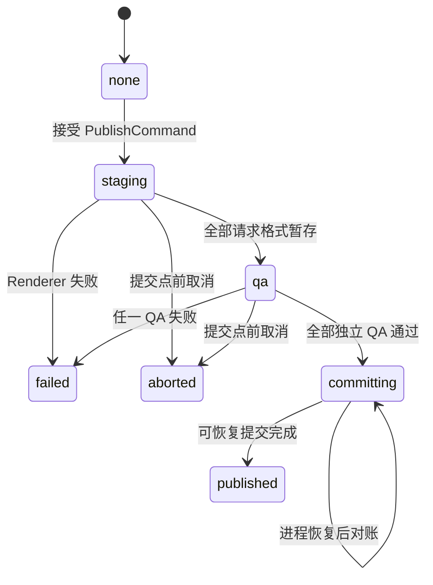

# Phase 4 D3：vNext 正式 Delivery 与默认切换状态机

> 文档状态：historical-design
>
> 2026-08-11：本文件引用的可抛弃状态机原型已在正式 Publisher 实现并通过工程门后移除。
> 当前实现状态只以 [`docs/status/current.md`](../status/current.md) 为准；下文原型命令仅作历史证据。

> 状态：已采纳；用户于 2026-07-30 明确确认 D3，本确认不授权进入 D4
>
> 日期：2026-07-30
>
> 对应 Issue：[GitHub #15](https://github.com/Eclipseic1848/Mangrove_platform/issues/15)
>
> 上游决策：
> [D2 统一能力模型与领域契约](2026-07-30-phase4-unified-domain-contract.md)、
> [ADR-0018](../adr/0018-unified-task-domain-contract.md)
>
> 本阶段性质：状态与 Interface 设计，加可抛弃逻辑原型；不接生产数据库、不切换入口、
> 不删除 Legacy。
>
> 2026-08-04 实施更新：Pi Candidate Adapter、通用 Publisher、独立 QA、确定性幂等和
> 可恢复提交已完成工程验证，等待用户验收；历史 Candidate 不回填。Rollout GateSnapshot、
> P0 自动阻断和默认入口切换仍未实现。证据见
> `2026-08-04-vnext-delivery-publisher-execution-report.md`。

## 1. 本轮要回答的问题

D3 不再讨论“vNext 能不能生成文件”，而是回答五个更严格的问题：

1. vNext 怎样从已验证 Candidate 形成与 Legacy 同语义的正式 Delivery；
2. 依赖获取、业务执行、验证、发布、取消和恢复怎样形成失败关闭状态机；
3. 如何保证重复请求、进程崩溃或文件系统与 SQLite 非原子时不产生两份交付或半成品；
4. vNext 如何从管理员灰度逐步扩大，且默认切换仍由用户单独确认；
5. P0 回归后如何立即回到 Legacy，而不迁移、覆盖或删除旧任务和既有 Delivery。

## 2. 当前阶段判断

当前处于 **规格编写 + 逻辑原型** 阶段，不是实现或诊断阶段。

本阶段完成条件：

- 冻结 Run、Delivery 和 Rollout 的状态所有权；
- 冻结正式发布协议、取消提交点、恢复和幂等规则；
- 用可抛弃原型走通关键正反场景；
- 形成默认切换/回滚 ADR 草案；
- 展示仍需用户确认的业务决策后停止。

## 3. 已验证事实

### 3.1 vNext 当前只到 Candidate

- `RuntimeStatus` 只有 `queued/preparing/running/candidate_ready/failed/cancelled`；
- vNext `VerificationReport.formal_delivery_eligible` 固定为 false；
- Pi 通过独立验证后，工作台和 revision 都停在 `candidate_ready`；
- 当前代码用中文注释明确说明 Publisher 尚未接入，不能把验证通过当成正式 Delivery。

证据：

- `src/agentic_runtime/models.py:27-43,166-190`
- `src/api/semantic_workspace_runtime.py:667-753`

### 3.2 Legacy 已有可复用发布能力，但 Interface 被 Legacy 契约绑住

Legacy `create_delivery()` 已有：

- 同卷 staging → final 原子改名；
- 全部请求格式通过独立重开 QA 后才发布；
- Manifest、SHA-256、不透明 `output_id`；
- owner 隔离下载和下载前完整性复核；
- 同一个 Legacy run 重试时返回已有 Delivery。

但当前 Interface 直接接收 `SemanticTaskPlan`、Legacy `run_id` 和内部物理路径；
`semantic_delivery_runs.run_id` 还外键绑定 `semantic_harness_runs`。因此 vNext 不能在不
制造假 Legacy Run 的情况下直接调用它。

证据：

- `src/semantic_harness/delivery/service.py:454-544`
- `src/semantic_harness/delivery/models.py:22-63`
- `src/api/store.py:332-360,2836-2926`
- `src/api/routes/semantic_deliveries.py`

### 3.3 当前已有局部恢复、取消和创建幂等，但没有统一发布状态机

- 创建任务支持按用户隔离的 `Idempotency-Key + request_hash`；
- Pi 支持官方会话恢复，并在恢复时重新绑定 owner、task 和 revision；
- 运行中取消会先终止 Pi 容器并撤销网络，再结束工作台协程；
- Legacy Harness attempt 有幂等键和失败指纹；
- 目前没有 vNext 发布幂等键、Delivery 提交日志或进程崩溃后的发布对账状态。

证据：

- `src/api/routes/semantic_workspace.py:358-500`
- `src/agentic_runtime/repository.py:87-163`
- `src/api/semantic_workspace_runtime.py:161-207,1153-1220`

### 3.4 依赖获取状态机仍缺失

业务执行阶段已经强制：

- 挂载用户来源；
- 只允许固定本地模型等已批准业务目标；
- 禁止访问 npm、PyPI、GitHub 等公共依赖站点。

现有文档要求公共依赖只能在“不挂载用户来源”的独立阶段获取，但该阶段尚未实现。这仍是
vNext 生产资格缺口。

## 4. 基于代码的判断

### 4.1 不能继续扩展一个全局 `task.status`

执行、交付和默认路由的生命周期不同：

- Run 可以已经得到验证通过的 Candidate；
- Delivery 可能还在 staging、QA、提交或失败；
- 平台可能仍由 Legacy 默认路由；
- 默认回滚后，已经发布的 Delivery 仍然是不可变历史。

把三者压成一个状态会重新产生“`candidate_ready` 是否等于 completed”“默认回滚是否要
改写历史任务”等冲突。

### 4.2 应深化现有 Publisher，而不是复制一份 vNext Delivery

正确的 Seam 在“已验证候选 → 冻结发布命令”，不在 Pi 或 Legacy 分支内部：

```text
Legacy verified result ─┐
                        ├─ CandidateAdapter → PublishCommand
vNext verified Candidate┘
                                      ↓
                         DeliveryPublishing Module
                                      ↓
                         同一 Manifest / QA / 下载语义
```

Legacy 现有 Renderer、QA、原子目录和下载校验是实现资产；`SemanticTaskPlan`、
`semantic_harness_runs` 外键和服务端绝对路径不是统一 Interface。

### 4.3 “正式 Delivery”与“vNext 已成为默认”是两个判断

管理员灰度中的单项任务可以在 owner 明确选择 vNext 后，通过完整 CandidateVerification
和 DeliveryPublishing 形成正式 Delivery；这不代表平台已经通过 30 项泛化集、用户验收或
默认切换门。

否则会形成循环依赖：没有正式 Delivery 就不能评测正式交付正确率，但未通过评测又永远
不能产生正式 Delivery。

## 5. 决策草案：三个正交状态机

### 5.1 总关系



约束：

1. Run 终态不直接写 Delivery 状态；
2. Delivery 必须引用唯一 Candidate 和 VerificationReport；
3. Rollout 只决定新 TaskRevision 的 RuntimeAssignment；
4. Rollout 回滚不修改历史 Run、Candidate 或 Delivery；
5. 工作台状态是三者的只读投影，不是第四套业务真相。

## 6. Run 状态机

### 6.1 状态

| 状态 | 含义 | 来源挂载 | 公共依赖网络 |
|---|---|---:|---:|
| `queued` | 已冻结 revision，等待执行 | 否 | 否 |
| `fetching_dependencies` | 获取冻结依赖，不得接触业务来源 | 否 | 仅受控允许 |
| `observing` | 读取获准来源并形成 SourceSnapshot | 只读 | 否 |
| `planning` | 根据已观察来源形成执行草案 | 只读 | 否 |
| `acting` | 使用任务工具生成或修正 Candidate | 只读 | 否 |
| `verifying` | Mangrove 独立重开来源和 Candidate | 只读 | 否 |
| `replanning` | 在不改变 GoalContract 下修正执行草案 | 只读 | 否 |
| `awaiting_user` | 业务含义、权限或外发边界需要用户决定 | 否 | 否 |
| `candidate_verified` | Candidate 已验证；尚不等于 Delivery | 否 | 否 |
| `failed` | 预算耗尽或不可恢复失败 | 否 | 否 |
| `cancelled` | 已撤销容器、网络和后续发布资格 | 否 | 否 |

`preparing`、`running` 等粗状态只作为工作台投影；持久业务状态使用上表。

### 6.2 主转换



### 6.3 依赖获取与业务执行隔离

1. 依赖阶段只接收冻结的依赖声明、工具版本和允许域名，不挂载来源、Goal 正文或候选；
2. 产物是按哈希引用的 `DependencyBundle` 或镜像层，不是业务 Candidate；
3. 进入业务阶段前撤销公共网络并重新创建任务环境，来源只读挂载；
4. 如果观察来源后发现缺少依赖，必须先停止当前业务环境，再回到
   `fetching_dependencies`；
5. 依赖完成后回到 `planning`，不能直接回到中断的任意 Shell 步骤；
6. Agent 只能申请登记过的依赖能力，不能把来源正文、URL 或任意安装命令带入依赖阶段。

### 6.4 有界执行

推荐冻结以下默认上限，与当前已验证的 Legacy/Pi 行为对齐：

- 暂时性基础设施失败：最多重试 2 次，使用同一效果幂等键；
- 独立验证驱动的语义重规划：最多 3 次；
- 相同失败指纹连续出现 2 次：立即停止；
- 一个 Run 最多 1 次初始执行加 3 次语义重规划；
- 任何重试都不能改变来源范围、字段、结果含义、格式、权限或外发对象。

资源预算的具体 Token、时间、磁盘和工具调用上限继续由生产配置和 D10 门冻结，不把
`1800 秒` 等当前机器参数写成业务语义。

### 6.5 用户确认与新 revision

以下情况可以在同一 Run 恢复：

- 在冻结选项中选择同义绑定；
- 确认一个已经预授权的无业务含义技术动作；
- 回答不改变 GoalContract 的定位问题。

以下情况必须停止当前 Run 并创建新 TaskRevision：

- 扩大或缩小来源范围；
- 改变连接键、记录粒度、字段、冲突策略或结果分类；
- 改变输出格式或数量；
- 新增外发对象、敏感数据或权限；
- 从个人模型连接切换平台连接，或反向切换。

## 7. 正式 Delivery 发布协议

### 7.1 发布前置条件

`DeliveryPublishing.publish()` 必须一次性验证：

1. actor 是 TaskOwner，或拥有明确的代理发布授权；
2. TaskRevision、GoalContract 和 DeliverySpec 均已冻结；
3. Candidate、Run、SourceSnapshot、VerificationReport 属于同一 owner 和 revision；
4. VerificationReport 状态为 passed，且引用的 Candidate 哈希未变化；
5. 候选文件集合与请求格式、数量、必须包含和明确不要完全一致；
6. 当前没有取消、P0 阻断或同 key 的冲突发布；
7. Agent、沙箱和 Renderer 都不是发布 actor。

任务提交时已经明确请求正式输出，因此在上述条件全部满足后推荐自动进入 Publisher，
不再弹出一个没有新增业务含义的二次确认框。

### 7.2 `PublishCommand`

统一 Interface 只接收身份与冻结哈希：

```text
PublishCommand
  owner_id
  task_id
  task_revision
  goal_contract_hash
  run_id
  candidate_id
  candidate_set_hash
  verification_report_id
  verification_report_hash
  delivery_spec
  delivery_spec_hash
  source_snapshot_refs
  publication_key
```

不接收：

- 原始 API Key；
- 客户端或 Agent 提供的绝对路径；
- 任意命令、镜像名、Renderer URL；
- 未登记的输出格式；
- “模型说已完成”一类自然语言成功标记。

### 7.3 发布状态



`committing` 是取消的线性化边界：

- 进入前必须重新检查取消与 P0 阻断；
- 进入前取消：删除 staging，不登记正式 `output_id`；
- 进入后取消：返回“发布提交中/已终结”，不能反向删除已提交文件；
- 发布后删除或归档属于 D9 生命周期，不复用“取消”。

### 7.4 文件系统与 SQLite 的可恢复提交

SQLite 事务与目录改名不能形成真正的跨资源原子事务，因此不能只写“原子发布”而忽略
崩溃窗口。推荐协议：

1. 以 `publication_key` 建立唯一 `PublishIntent(status=staging)`；
2. Renderer 只写同卷 staging，输出尚无公共下载身份；
3. 独立 QA 重开每个文件，写冻结 Manifest 和哈希；
4. 在数据库把 Intent 改为 `committing`，记录 commit token；
5. 同卷原子改名到 final；
6. 一个 SQLite 事务登记 Delivery、outputs 并置为 `published`；
7. API 只读取 `published` 行，磁盘 final 目录本身不授予下载权。

恢复对账：

| 观察 | 恢复动作 |
|---|---|
| 只有 staging + `staging` Intent | 复核输入哈希后继续，或安全清理再用同 key 重试 |
| final 已存在 + Intent 为 `committing` | 重开 Manifest/outputs；一致则完成数据库提交 |
| 数据库为 `published` + 文件完整 | 返回既有 Delivery |
| 数据库为 `published` + 文件缺失/哈希错误 | 下载失败关闭并触发 P0；不得重新生成覆盖历史 |
| 同 key 但冻结输入哈希不同 | 409 冲突，要求新 Candidate 或 revision |

### 7.5 发布幂等键

推荐：

```text
publication_key = SHA-256(
  owner_id
  + task_revision_hash
  + candidate_set_hash
  + verification_report_hash
  + delivery_spec_hash
)
```

- 同 key、同输入：返回同一 Delivery；
- 同 key、不同输入：冲突；
- 暂时性重试：复用同 key 并追加 attempt；
- Candidate、VerificationReport 或 DeliverySpec 改变：产生新 key；
- 正式 Delivery 不覆盖，新的合法结果形成新 Delivery revision。

### 7.6 Candidate 与 Delivery 的产品边界

- Candidate 可以用于带风险标记的 owner 预览或诊断；
- Verification failed/inconclusive 时不得调用 Publisher；
- Candidate 下载不得使用正式 `output_id`、正式 Manifest 或“已完成”文案；
- `eligible_for_delivery` 只可作为旧兼容投影；
- 只有 `delivery=published`、正式 `delivery_id` 和通过下载时完整性校验的 `output_id`
  才能显示“正式交付”。

## 8. 默认入口切换与回滚

### 8.1 Rollout 状态

| 状态 | 新 TaskRevision 默认 Runtime | 谁可以显式使用 vNext |
|---|---|---|
| `legacy_default` | Legacy | 无 |
| `admin_gray` | Legacy | 管理员逐任务选择 |
| `vnext_default` | vNext | 普通用户默认；仍可显式选 Legacy |
| `legacy_rollback` | Legacy | 暂停新 vNext Run 和发布 |

当前事实投影为 `admin_gray`。

`explicit_opt_in` 已由 ADR-0030 取消为可进入阶段；历史数据库若存在该值，新 revision 全部
路由 Legacy，且只能恢复到 `admin_gray`。

影子运行不是 Rollout 状态，而是 `RunPurpose=shadow`：

- 不改变用户选中的 Runtime；
- 影子 Candidate 不进入 Publisher；
- 影子结果不向普通用户展示或替换正式 Delivery。

### 8.2 扩大条件

```text
admin_gray
  --D10 生产硬门 qualified + 用户单独确认--> vnext_default
```

以下项目不能单独触发默认切换：

- 某一真实任务 3/3；
- 某次完整测试通过；
- Candidate 验证通过；
- 已经能创建正式 Delivery；
- 综合分高但任一 P0 失败；
- Issue、PR、版本分支或计划名称显示“完成”。

### 8.3 默认切换的作用域

- 只影响切换后创建的新 TaskRevision；
- 已有 TaskRevision 的 RuntimeAssignment 不改变；
- Legacy 旧任务及其新修订默认继续 Legacy，除非用户显式创建 vNext 修订；
- 不迁移运行检查点、候选、数据库行或文件目录；
- 不删除、不覆盖、不重新发布已有 Delivery。

### 8.4 P0 回滚

任一已冻结核心 P0 从 qualified 变为 failed：

1. 原子把新 revision 默认路由改回 Legacy；
2. 阻止新的 vNext Publisher 提交；
3. 记录 GateSnapshot、影响范围和回滚原因；
4. 已发布 Delivery 保持不可变，下载仍执行 owner/哈希/完整性门；
5. 修复后必须重新跑完整门，并由用户确认回到 `admin_gray`，不能自动恢复默认。

在途处理建议区分：

- **安全、所有权、未授权外发 P0**：撤销网络并取消所有在途 vNext Run；
- **语义正确率、格式或稳定性 P0**：允许在途 Run 收口为带标记 Candidate，但阻止新正式
  发布；
- 已进入 `committing` 的发布完成可恢复提交，但访问层可以根据安全事件失败关闭；
- 已正式发布的历史 Delivery 不能用回滚状态静默删除，物理治理属于 D9。

## 9. 深 Module 与 Interface

### 9.1 RunOrchestration Module

```text
start(task_revision_ref, runtime_assignment, idempotency_key) -> RunSnapshot
resume(run_id, decision, actor) -> RunSnapshot
cancel(run_id, actor) -> RunSnapshot
recover(run_id) -> RunSnapshot
```

隐藏：

- 依赖与业务环境切换；
- AgentKernel `start/resume/cancel`；
- 重试、重规划、失败指纹和检查点；
- 事件持久化与工作台投影。

Docker/Pi 是内部 Adapter，不进入业务调用方 Interface。

### 9.2 DeliveryPublishing Module

```text
publish(command, actor) -> Delivery | PublishFailure
resolve(delivery_id, actor) -> Delivery
recover(publication_key) -> Delivery | PublishFailure
```

隐藏：

- Candidate Adapter；
- Renderer/Converter 选择；
- staging、QA、Manifest、提交日志和恢复；
- owner 下载身份。

正式发布能力不能登记为 CapabilityTool，也不能暴露给 AgentKernel。

### 9.3 RuntimeRouting Module

```text
resolve(task_revision_ref, actor) -> RuntimeAssignment
record_gate(snapshot, actor) -> RolloutSnapshot
change_mode(target_mode, approval, actor) -> RolloutSnapshot
```

隐藏：

- 灰度成员、显式试用和默认规则；
- GateSnapshot 历史；
- P0 自动回滚和新启动阻断；
- Legacy/vNext Adapter 选择。

### 9.4 依赖类别

- SQLite、同卷文件系统：本地可替换依赖；测试应通过真实临时 SQLite/目录跨 Interface；
- Pi/Docker：本项目拥有的远程/进程 Adapter；使用假 Adapter 验证编排状态；
- npm/PyPI/GitHub、外部模型：真实外部依赖；经受控端口和策略 Adapter；
- Legacy/vNext Candidate：两个真实 Adapter，统一 Publisher Seam 已成立。

## 10. 持久化与兼容输入

D3 只冻结数据语义，不实施迁移。后续规格至少需要：

1. 通用 `runtime_assignment`，冻结到 TaskRevision；
2. 通用 Run 状态、phase、预算、检查点和失败指纹；
3. Candidate 集合哈希和 VerificationReport 身份；
4. `PublishIntent`、Delivery attempt、commit token 和 publication key；
5. Delivery 直接引用 task/revision/candidate/verification，不再要求伪造
   `semantic_harness_runs` 外键；
6. RolloutMode 与 append-only GateSnapshot；
7. 工作台状态只从上述记录投影。

兼容策略：

- 历史 `semantic_delivery_runs` 只读保留；
- Legacy 新结果经 LegacyCandidateAdapter 进入统一 Publisher；
- vNext 经 PiCandidateAdapter 进入同一 Publisher；
- 现有 `/api/semantic-deliveries/...` 路由和 `DeliveryManifest` 公共字段保持兼容；
- 不回填历史 Candidate，不迁移旧任务，不删除旧输出。

## 11. 可抛弃状态机原型

### 11.1 问题

验证把 Run、Delivery、Rollout 分离后，是否能表达：

- Candidate 通过但尚未发布；
- 依赖获取与来源挂载互斥；
- 同失败指纹停止；
- 提交点前取消为零正式输出；
- QA 失败不冒充完成；
- P0 回滚不改写已发布历史。

### 11.2 位置与命令

- `src/agentic_runtime/prototypes/d3_delivery_state_machine.py`
- `src/agentic_runtime/prototypes/d3_delivery_state_machine_tui.py`
- `src/agentic_runtime/prototypes/README.md`

```powershell
E:\python3.13\python.exe -X utf8 `
  src/agentic_runtime/prototypes/d3_delivery_state_machine_tui.py --scenario all
```

原型无持久化、无外部依赖、无生产导入；D3 决策吸收后应删除。用户未授权创建原型分支或
提交，因此本阶段只保留工作区文件。

### 11.3 初步结果

六个内置场景均能维持不变量：

| 场景 | 结果 |
|---|---|
| 正常发布与默认切换 | Candidate、QA、Delivery、生产硬门和用户切换逐层成立 |
| 依赖隔离 | 公共网络开启时来源未挂载，业务阶段公共网络关闭 |
| 同失败指纹 | 连续 2 次相同失败后 Run 失败，零 Delivery |
| 提交点前取消 | Candidate 保留，Delivery 为 aborted，禁止发布 |
| QA 失败 | Delivery 为 failed，零正式输出 |
| P0 回滚 | 路由变为 legacy_rollback，历史 Delivery 不被改写 |

原型支持交互按键，可由用户手动尝试非法转换；非法动作通过 `TransitionDenied` 失败关闭。
另行执行的守卫探针为 `3/3`：候选未验证直接发布、硬门未通过直接切默认、正式发布后用
取消撤销，三者均被拒绝。

## 12. 失败关闭矩阵

| 事件 | Run | Delivery | Rollout / 用户看到什么 |
|---|---|---|---|
| 依赖下载失败 | 重试最多 2 次后 failed | 无 | 说明依赖阶段，未读取来源 |
| 来源哈希变化 | failed | 无 | 要求重新冻结来源或新 revision |
| 业务含义不明确 | awaiting_user | 无 | 一个高价值问题 |
| 验证失败可修复 | replanning | 无 | 显示有界修正 |
| 相同失败两次 | failed | 无 | 显示失败指纹和下一步 |
| Candidate 数量/格式不符 | replanning 或 failed | 无 | 不调用 Publisher |
| Renderer/QA 失败 | candidate_verified | failed | 候选可诊断，正式输出为零 |
| 提交点前取消 | 保留 Candidate 或 cancelled | aborted | 明确未发布 |
| 提交点后取消 | Run 已终结 | committing/published | 告知发布已提交，不能用取消删除 |
| 重复 publish | 不变 | 返回同一 Delivery | 不生成第二份 |
| published 文件篡改 | 不变 | 历史记录保留 | 下载 409，触发 P0 |
| 质量 P0 回归 | 在途可收口 Candidate | 阻止新发布 | 新任务回 Legacy |
| 安全 P0 回归 | 取消在途 vNext | 阻止新发布 | 新任务回 Legacy |

## 13. 对 #2–#10 的覆盖关系建议

本阶段只给建议，不自动编辑或关闭这些历史 Issue。

| Issue | D2/D3 覆盖 | 建议 |
|---|---|---|
| #2 总任务 | 统一任务域、Delivery 与切换状态已补齐 | 保持打开，作为历史总任务索引 |
| #4 GoalContract/Run | D2 词汇和 D3 Run 状态覆盖设计层 | 不关闭；实现 Schema/迁移仍缺 |
| #5 Tool Catalog/Adapter | Candidate Adapter 与 Publisher Seam 已明确 | 保持打开；工具目录和多模态 Adapter 未完成 |
| #6 任务级沙箱 | 已有主链证据，D3 补依赖隔离状态 | 保持打开；独立依赖阶段仍缺 |
| #7 动态 Loop | D3 冻结重试、恢复、取消和失败指纹 | 保持打开；生产实现与完整恢复门未完成 |
| #8 Context/Skill | D3 不覆盖 | 保持打开 |
| #9 工作台 UX | D3 给出候选/交付/失败的状态语义 | 保持打开；D8 再做统一 UI 原型 |
| #10 评测/默认切换 | D3 给出 Rollout 状态和回滚协议 | 保持打开；D10 冻结语料并实际跑门 |

## 14. D3 确认记录

### 已采纳决策

用户于 2026-07-30 明确接受以下决策：

1. Run、Delivery、Rollout 使用三个正交状态机；工作台状态只作投影；
2. Candidate 独立验证通过且原 Goal 已要求正式输出时，自动进入 Publisher，不再二次弹窗；
3. `committing` 是取消线性化点：之前取消零发布，之后不能用取消反向删除；
4. 发布幂等键绑定 owner、revision、Candidate、VerificationReport 和 DeliverySpec 哈希；
5. 依赖阶段无来源挂载，业务阶段无公共依赖网络；中途缺依赖必须退出业务环境后再获取；
6. 默认上限为暂时性重试 2 次、语义重规划 3 次、相同失败连续 2 次立即停止；
7. 管理员灰度 → 用户显式试用 → 生产硬门通过 → 用户单独确认默认切换；
8. 质量 P0 阻断发布但允许在途任务收口为 Candidate；安全 P0 取消在途 vNext；
9. 回滚只影响新 revision 路由，不迁移、删除或覆盖旧任务和既有 Delivery；
10. Legacy 和 vNext 通过 Candidate Adapter 复用同一 Publisher，不建设两套正式交付语义。

2026-08-23：第 7 项的中间 `explicit_opt_in` 阶段由 ADR-0030 取代；当前为硬门合格并独立
授权后从 `admin_gray` 直接进入 `vnext_default`，其余安全边界不变。

### 封存与同步动作

- ADR-0019 状态已正式记为 `accepted`；
- D3 新术语已同步到 `CONTEXT.md`；
- GitHub #15 在本轮封存时同步并以 `completed` 关闭；
- 可抛弃原型暂时保留为本地验证证据；用户尚未授权删除；
- D4 尚未开始，只有用户另行明确授权后才可进入；“同意 D3”本身不构成进入
  D4 的授权。

## 15. 本阶段明确不做

- 不接 vNext Publisher；
- 不修改数据库 Schema 或生产状态枚举；
- 不实现独立依赖获取阶段；
- 不开放普通用户 vNext；
- 不运行 D10 的 30 项泛化集；
- 不切换默认入口或触发真实回滚；
- 不编辑/关闭 #2、#4–#10；
- 不创建分支、提交、PR、版本、标签或外部发布；
- 不进入 Phase 4C、8B、Conductor 迁移或 Phase 5。
