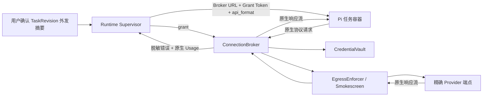

# Phase 4 D4：外部服务、个人 API Key 与受控外发契约

- 状态：`architecture_accepted`；首个后端连接纵切面已实现并待用户确认，不构成
  真实外发、不可逆迁移、后续纵切面或 D5 授权
- 日期：2026-07-30
- 对应 Issue：GitHub #16 `[Wayfinder][D4] 外部服务、个人 API Key 与受控外发契约`
- 上游：
  [Phase 4 D2 统一领域契约](2026-07-30-phase4-unified-domain-contract.md)、
  [Phase 4 D3 状态机](2026-07-30-phase4-d3-delivery-default-state-machine.md)、
  [ADR-0018](../adr/0018-unified-task-domain-contract.md)、
  [ADR-0019](../adr/0019-vnext-delivery-and-default-cutover-state-machine.md)
- 调研：
  [D4 Provider 连接与安全调研](../research/2026-07-30-phase4-d4-provider-connection-security-research.md)
- 拟议 ADR：
  [ADR-0020](../adr/0020-provider-connection-broker-and-credential-isolation.md)

## 1. 当前阶段与本轮结论

D4 的**架构决策阶段已经完成**，当前进入最小价值纵切面的规格与实现。用户于
2026-07-30 明确要求停止继续拆分安全微决策，先完成会影响返工的架构骨架和可用功能。
因此，本文件后半部分的完整威胁模型继续作为后续加固输入，不再作为首个纵切面的实施门槛。
不会自动进入 D5。

本草案提出一个逻辑上的深 Module，而不是新增一组微服务：

> 所有本地、平台共享和用户个人模型连接，都通过 `ConnectionBroker` 获得任务级临时
> `AccessGrant`；Agent 可以持有受限 Grant Token，但永远拿不到 Provider 原始 API Key。

首批支持 D2 已确认的四种线上格式：

- `anthropic_messages`
- `openai_chat_completions`
- `openai_responses`
- `gemini_generate_content`

Mangrove 不在首批范围内做跨协议翻译。连接可以指向用户自己的兼容网关，但必须显式标记
`gateway_translated`；不得仅凭 URL 猜测格式，也不得把一种格式失败后静默改用另一种。

## 2. 已验证事实

### 2.1 已确认的业务边界

1. 用户已在 D4-A 进一步澄清：已知 Provider 的默认入口使用平台预设，用户先选择 Provider
   卡片，再只填写 API Key；普通路径不要求理解或填写 URL、API 格式和模型 ID。
2. 领域契约仍使用 `ModelConnection`，并显式保存最终冻结的 `base_url`、`model`、
   `api_format` 和秘密引用；平台预设只是这些字段的可信来源，不把它们从契约中删除。
3. 系统角色只有普通用户 `user`、管理员 `admin` 和超级管理员 `super_admin`；D4 的连接治理
   将管理员与超级管理员视为同一管理权限类型，不引入“高级用户”等新角色。
4. 用户个人连接只能由本人任务使用；管理员只能查看脱敏元数据、状态和原生用量，不能查看、
   导出或代用明文 Key。
5. 个人连接失败时不得静默改用平台连接。
6. API Key、Cookie、密码等秘密不得进入 Task、Event、Evidence、Candidate、Delivery
   或 Agent 容器。
7. 只记录 Provider 原生返回的 Token、请求数或多媒体计量；缺失时为 `unknown`，不估算
   费用，不建设钱包、充值、定价、预算或计费账本。
8. 已确认保留 Agent 内部普通 HTTP Token 流；不开发 WebSocket/WebRTC 实时音视频或实时
   双工会话。

### 2.2 当前代码与数据状态

以下事实来自当前工作树，只描述现状，不表示已经满足 D4：

| 位置 | 已验证现状 | D4 差距 |
|---|---|---|
| `src/config/runtime_config.py:61-70` | 普通用户只能覆盖 DeepSeek、Qwen 的 API Key；Base URL 和模型仍是全局项 | 没有完整的用户级 ModelConnection |
| `src/api/auth.py:26-36`、`frontend/src/lib/auth.tsx:12-16` | 角色只有 `user/admin/super_admin`；前后端都把后两者视为管理权限类型 | D4 不应发明“高级用户” |
| `src/api/routes/config_routes.py:110-140` | 自助配置按 `user_id` 隔离，读取时只返回遮罩值 | 遮罩不等于密文存储 |
| `src/api/store.py:67-74,758-765` | `runtime_config.value` 是通用 `TEXT`，当前 Key 原样写入 | 个人 Key 静态明文 |
| `src/api/store.py:995-1005` | 删除用户会删除会话和个人记忆，但没有删除其 `runtime_config` | 会遗留孤儿凭证 |
| `src/services/db_connections.py:31-51` | 数据库连接密码已有 Fernet 先例，但未配置专用 Key 时回退复用 JWT Secret | 不能原样复用为版本化 Provider SecretStore |
| `src/llm/provider.py:368-390` | 个人 Key 通过 ContextVar 覆盖；没有显式连接身份时使用平台配置 | 无法表达“选中的个人连接失败即失败关闭” |
| `src/llm/provider.py:326-335` | 客户端缓存键含 `hash(api_key)`，缓存客户端仍持有 Key | 撤销、轮换和缓存失效没有连接版本边界 |
| `src/llm/provider.py:37-46` | Provider 未返回 usage 时用空字典累加为 0 | 把 unknown 错写成 0 |
| `src/scheduler/service.py:187-199` | 用户覆盖加载失败时明确回落全局配置 | 违反未来个人连接不得静默回退的约束 |
| `src/agentic_runtime/models.py:70-84` | `PiRuntimeRequest` 直接携带 `api_key` | Runtime 请求仍暴露原始凭证 |
| `src/agentic_runtime/pi_runtime.py:813-849` | 原始 Key 写入任务配置目录的 `models.json`，该目录挂载进 Agent 容器 | 直接违反 D4 目标边界 |
| `src/api/semantic_workspace_runtime.py:562-580` | 灰度入口只传本地占位 Key，持久化请求排除了 `api_key` | 台账侧已有局部安全做法，但 Runtime 类型仍不安全 |
| `src/agentic_runtime/egress_policy.py:79-142` | 业务阶段只允许固定本地或局域网模型地址 | 当前还不能安全开放外部模型 |
| `src/connectors/http_security.py:126-180` | 会解析全部 A/AAAA，并拒绝回环、链路本地、保留地址、云元数据和默认私网 | 可复用 URL 预检能力 |
| `src/connectors/http_api_connector.py:184-197` | 每跳请求前校验 URL，`trust_env=False`；同时允许自动重定向 | 校验后 httpx 再解析 DNS，未钉住已验证地址；重定向仍扩大泄密面 |

现有定向回归：

```text
E:\python3.13\python.exe -m pytest -q \
  tests/test_llm_provider.py tests/test_models_api.py tests/test_http_security.py \
  --basetemp .pytest-tmp\d4-provider-audit

46 passed, 2 warnings in 5.68s
```

这只证明当前 Provider 选择、模型目录和 URL 预检没有被审计破坏，不证明 D4 已实现。

### 2.3 协议与现成运行时能力

1. 生产镜像固定 `@earendil-works/pi-coding-agent@0.80.10`；仓库内相同版本的
   `pi-ai` 已包含 `anthropic-messages`、`openai-completions`、
   `openai-responses` 和 `google-generative-ai` 四类原生 API 实现。
2. 当前 `requirements.txt` 已固定 `cryptography`、OpenAI 和 Anthropic SDK；尚未加入
   Google Gen AI SDK 或 LiteLLM。
3. D2 的四个名称可一一映射到 Pi，无需为了首批格式引入 Mangrove 自己的跨协议翻译器：

| D2 `api_format` | Pi 0.80.10 API | 首批路线 |
|---|---|---|
| `anthropic_messages` | `anthropic-messages` | 原生请求/响应透传 |
| `openai_chat_completions` | `openai-completions` | 原生请求/响应透传 |
| `openai_responses` | `openai-responses` | 原生请求/响应透传 |
| `gemini_generate_content` | `google-generative-ai` | 原生请求/响应透传 |

4. OpenAI Chat Completions 与 Responses 是不同端点和对象模型；不能因都由 OpenAI
   兼容端点提供就合并为一个格式。Responses 默认可能保存响应，D4 应在支持时默认发
   `store=false`，同时不得把该参数表述为对第三方兼容网关的数据保留保证。
5. LiteLLM 能覆盖大量 Provider，也提供兼容入口，但近期仍有 Anthropic pass-through 和
   Anthropic→Responses 适配问题。它适合成为用户可选择的外部网关，不适合作为首批
   安全边界内的强制翻译核心。
6. Smokescreen 已在现有 Pi 出站纵切面证明可以执行域名、端口和 IP 目的地策略；它不能检查
   TLS 内部业务正文，因此仍需应用层 Grant、路径和载荷类别约束。

## 3. 基于代码的判断

以下是架构推断，不是已经实现的事实：

1. 继续扩展 `runtime_config` 会把普通设置、Secret、连接状态和权限混在一个浅表 KV 中；
   无法可靠完成轮换、撤销、删除和按连接版本审计，因此 Secret 必须迁出。
2. 只在应用层做一次 DNS 校验不能关闭 DNS rebinding。实际连接必须经受控代理重新执行
   目的地策略，或者使用已验证地址连接并保持正确 TLS SNI；首批推荐复用 Smokescreen。
3. Pi 已原生支持四个格式，最小且最可靠的 Seam 是“原生协议 Adapter + 凭证代理”，
   不是在 Mangrove 内复制一套 LiteLLM。
4. ConnectionBroker 需要隐藏秘密存储、协议鉴权、出站策略、原生用量和撤销复杂性，但
   仍可以是当前后端进程内的逻辑 Module；D4 不要求独立部署。
5. Agent 生成过程依赖普通 HTTP 流式响应。保留 SSE/分块响应透传不会形成实时音视频产品；
   若连这种传输也排除，Pi 的四协议原生 Adapter 将无法按既有接口工作。

## 4. 已确认的架构基线与后置项

### 4.1 建议一：平台预设优先，自定义连接保留

**确认状态：** 用户已于 2026-07-30 明确确认：

- D4-A1：已知 Provider 默认由平台预设 URL 和模型列表，用户不需要理解这些技术字段，只需
  选择 Provider 并填写 API Key；
- D4-A2：保留默认折叠的“自定义兼容接口”功能，首批平台 Preset 为 DeepSeek、
  阿里百炼 Qwen、OpenAI、Anthropic 和 Gemini；
- D4-A3：保留当前 Pi Runtime 必需的普通 HTTP Token 流，仅用于内部文字响应传输；不开发
  Realtime、WebSocket、WebRTC 或实时音视频产品功能。

默认路径：

1. 用户选择一个平台维护的 Provider 卡片；
2. 用户只粘贴 API Key；
3. `ProviderPreset` 提供官方 Base URL、协议路线、友好模型列表、推荐默认模型和鉴权方式；
4. 界面明确展示即将使用的 Provider 和推荐模型，但隐藏 `api_format`、底层路径等术语；
5. 平台只对推荐默认模型做一次最小真实验证；其他模型首次被选择时再验证，避免为整张模型表
   产生 Token 成本；
6. 验证通过后，该用户自己的任务才能选择该连接。

平台不能通过 Key 前缀推断 Provider：Key 形式不是稳定、可信的身份协议，而且兼容网关可能复用
相同格式。用户至少需要点击一次 Provider 卡片；如果同一 Provider 存在无法安全推断的区域或
数据驻留版本，平台只能让用户选择易懂的“区域/账户类型”，不能暗中猜测或暴露原始 URL。

自定义连接路径：

- 设置页保留默认折叠的“自定义兼容接口”；
- 只有自定义连接才要求填写 `base_url`、模型名、`api_format` 和 Key；
- LiteLLM、OpenRouter、自建网关和未被平台预设覆盖的长尾 Provider 走该路径；
- 四种已确认格式都作为底层原生路线，Mangrove 不做跨格式自动转换；
- 网关连接必须记录 `transport_mode=native` 或 `gateway_translated`；
- 普通 HTTP SSE/分块 Token 流属于内部传输，纳入首批；
- WebSocket、WebRTC、Realtime API、实时音视频输入输出继续排除。

“自定义连接”是功能类型，不是角色。普通用户不创建自定义 Endpoint；管理员和超级管理员
作为同一连接治理权限类型，可以创建、验证、停用和发布自定义公网或精确登记的局域网连接。

首批平台预设已确认为 DeepSeek、阿里百炼 Qwen、OpenAI、Anthropic 和 Gemini。精确模型清单
属于易变化的目录数据，不在 D4 ADR 中写死，实施时以官方资料和真实验证冻结首版。
Preset 中的模型被 Provider 下线或验证失效时，连接进入“需要重新选择模型”，不能静默切换到
另一个模型。

### 4.2 建议二：公网开放协议，不开放任意网络

- 平台预设的 URL 由平台维护，普通用户不可编辑；
- 只有管理员和超级管理员可以创建自定义连接；普通用户只使用平台发布的 Preset，并配置
  仅本人可用的 API Key；
- 公网自定义连接只允许 **公网 HTTPS** 域名，不设 Provider 品牌白名单；
- 平台只允许四种协议、固定推理路径、固定鉴权方式和经过验证的能力；
- 公网 HTTP、自动重定向、自定义代理、关闭 TLS 校验、任意请求 Header 和用户自定义 CA
  首批均不开放；
- 管理员和超级管理员作为同一管理权限类型，可以登记 `local_managed`/`managed_private`
  连接，精确批准 `scheme + host/IP + port + protocol route`；
- 明确批准的 `http://192.168.x.x:port`、其他 LAN 地址和确有需要的本机服务不是禁止项；
  它们验证通过后成为平台 Preset，普通用户按权限使用而不填写内网地址；
- 不允许把整个 `192.168.0.0/16` 或任意私网放开，只允许已登记的具体服务；
- 云元数据、链路本地、Docker/容器管理端口和未登记的内网地址即使管理权限类型也不能放行；
- 管理员可设置全局域名拒绝清单，但普通公网连接不要求逐域名人工审批。

这让普通用户只填 Key，同时保留长尾 Provider 和本地/LAN 模型，又不把“自定义 Base URL”
变成服务器内网扫描器。

### 4.3 建议三：每个 TaskRevision 一次外发确认

本节保留为后续任务外发纵切面的设计输入，不阻塞首个“连接创建、验证和选择”纵切面。

保存连接时只发送合成探针，不发送任务或来源内容。真正执行前生成不可变
`OutboundDisclosure`，至少展示：

- 连接显示名、协议、模型、外部 Host 和是否经网关转换；
- 本次用途；
- 将外发的载荷类别；
- Provider 数据保留控制是“已请求关闭”“Provider 声明”还是“未知”；
- 授权对应的 TaskRevision。

用户对同一 TaskRevision 确认一次后，该 Revision 内同一目的地和同一载荷类别的有界调用
不逐次弹窗。下列变化必须停止当前 Run，并创建新 Revision 或重新确认：

- 更换连接、Host、模型或网关转换路线；
- 新增来源、载荷类别、敏感数据或外发用途；
- 从个人连接切换平台连接，或反向切换；
- 从文本/结构化片段扩大到原文件、图片、音频或视频。

### 4.4 建议四：立即撤销并清除在线秘密，备份按删除台账收口

首个纵切面必须做到在线凭证隔离、所有者校验、停用后不可继续使用以及 Agent 不持有原始
Key。逐 Secret DEK、KEK 自动轮换、历史 WAL/备份密码学擦除和外部 Vault/HSM 接入后置，
不作为首个纵切面的完成条件。

- 删除、撤销或账户删除时立即撤销 Grant、清除内存/缓存并删除在线库中的 Credential
  Ciphertext；
- 只保留不含 Secret、不可用于调用的审计墓碑；
- 旧 SQLite 页、WAL 或备份不能诚实承诺瞬时物理擦除；恢复流程必须先应用删除台账，禁止
  已删除 Secret 重新激活，并在冻结的备份保留期结束后消失；
- 原任务、来源快照、Candidate、Delivery 的生命周期继续由 D9 决定；
- 用户更换 Key 时先验证新 SecretVersion，再原子激活并撤销旧 Grant；
- 怀疑泄露时提供“立即停用”，不等待新 Key 验证。

## 5. 统一领域模型

### 5.1 ProviderPreset

`ProviderPreset` 是平台维护、无 Secret、可版本化的连接模板：

```text
ProviderPreset
  preset_id
  preset_version
  display_name
  help_text
  credential_kind
  default_route_id
  default_model_id
  routes[]
    route_id
    api_format
    transport_mode
    base_url
    auth_profile
  model_catalog[]
    model_id
    display_name
    capability_hints[]
    catalog_source: platform_curated | provider_listed
  status
```

不变量：

1. Preset 不包含用户或平台 API Key；
2. 用户不能编辑 Preset URL、协议和鉴权字段；
3. Key 前缀不能选择 Preset；
4. Provider 返回的模型列表只能证明“被列出”，不能证明模型、工具或多媒体能力已经验证；
5. Preset 更新创建新 `preset_version`，不能静默改写既有 TaskRevision；
6. 一个用户在同一 Preset 下只需配置一次 Credential；平台可以基于该 Credential 生成多个
   明确的协议路线，但每个实际 ModelConnection 仍冻结唯一 `api_format`、模型和 Route；
7. 推荐默认模型变更只影响新的选择，既有 Revision 不自动换模型。

### 5.2 ModelConnection

`ModelConnection` 是可供任务选择的模型服务身份，不包含 Secret 明文：

```text
ModelConnection
  connection_id
  owner_scope: platform_shared | user_personal | managed_private
  owner_user_id?
  display_name
  configuration_mode: preset | custom
  preset_id?
  preset_version?
  route_id?
  api_format
  transport_mode: native | gateway_translated
  base_url
  model
  locality: public_external | managed_private | local_managed
  secret_ref?
  connection_version
  declared_capabilities[]
  capability_snapshot_id?
  status
```

不允许保存：

- API Key、Cookie、密码或可还原 Secret；
- 任意自定义 Header；
- 带 userinfo、query 或 fragment 的 Base URL；
- 由 URL 猜出的 API 格式；
- 未经验证却标记为 verified 的能力。

平台预设连接的 URL、格式和初始模型来自冻结的 Preset；自定义连接只由管理员或超级管理员
显式提供。两种功能进入相同的验证、Broker、Grant 和外发流程，不能形成安全捷径。

### 5.3 CredentialSecret 与 SecretVersion

```text
CredentialSecret
  secret_id
  owner_user_id | platform_owner
  credential_binding: preset_id | custom_connection_id
  current_version_id?
  status

SecretVersion
  secret_version_id
  ciphertext
  nonce
  wrapped_dek
  aad_schema_version
  kek_version
  created_at
  activated_at?
  destroyed_at?
  state: pending | active | superseded | revoked | destroyed
```

核心不变量：

1. Secret 与 ModelConnection 分表、分权限、分 Interface；
2. 每个 SecretVersion 使用独立随机 DEK 和 AES-GCM 认证加密；AAD 至少绑定 Owner、
   Connection、Secret generation 和 Schema version，防止跨行替换；
3. 版本化 KEK 只包裹 DEK，不与数据库同库保存，也不复用 JWT Secret；KEK 轮换只需
   rewrap DEK；
4. 产品管理员不能通过 UI/API 查看、导出或代用用户 Secret；
5. 后端受信 Broker 在一次调用内可以短暂解密；拥有主机与主密钥的系统运维者仍属于
   信任边界，不能虚假承诺为端到端零知识；
6. 日志、异常、Tracing、任务 JSON、事件、证据、下载和 Agent 容器不得出现原始 Secret。

同一用户的 Preset Credential 可以被该 Preset 派生的多个 ModelConnection 引用，但不能跨
用户、跨 Preset 或被管理员代用。

### 5.4 ConnectionVerification

验证结果绑定精确的连接版本和 SecretVersion：

```text
ConnectionVerification
  verification_id
  connection_id
  connection_version
  secret_version_id
  checked_at
  final_endpoint_host
  api_format
  model
  transport_mode
  capability_results[]
  usage_status
  sanitized_error?
  result: passed | failed
```

验证次序：

1. Schema 与 URL 规范化；
2. DNS/IP/端口/重定向策略；
3. TLS 验证；
4. 协议规定的鉴权注入；
5. 无业务数据的最小文本推理；
6. 请求/响应/错误和 Usage 解析；
7. 用户启用的额外能力使用合成输入单独验证。

最低只验证 `text_inference`。`tool_calling` 是 Pi Agentic Runtime 的必要能力；图片、音频、
视频和文件能力由 D5/D6 决定启用顺序，未验证能力不得签发相应用途的 Grant。

### 5.5 CapabilitySnapshot

能力不能用“没测到就默认支持”的布尔值表达：

```text
CapabilitySnapshot
  capability_snapshot_id
  connection_id
  connection_version
  secret_version_id
  api_format
  transport_mode
  adapter_version
  gateway_name_and_version?
  probed_at
  capabilities:
    text_inference: verified | unsupported | unknown | not_probed
    tool_calling: verified | unsupported | unknown | not_probed
    structured_output: verified | unsupported | unknown | not_probed
    image_input: verified | unsupported | unknown | not_probed
    file_input: verified | unsupported | unknown | not_probed
    audio_input: verified | unsupported | unknown | not_probed
    video_input: verified | unsupported | unknown | not_probed
    token_stream: verified | unsupported | unknown | not_probed
    usage: verified | unsupported | unknown | not_probed
```

一次最小文本生成只能验证连接、认证、模型和文本推理，不能顺带把工具、文件、多媒体或 Usage
标为 verified。Grant 必须引用精确 Snapshot，网关或 Adapter 版本变化后需要重新验证。

### 5.6 AccessGrant

`AccessGrant` 是短期、可撤销的能力，不是 Provider 凭证：

```text
AccessGrant
  grant_id
  token_hash
  owner_user_id
  task_id
  revision
  run_id
  runtime_instance_id
  purpose
  connection_id
  connection_version
  secret_version_id
  api_format
  capability_snapshot_id
  allowed_operations[]
  allowed_payload_classes[]
  expires_at
  status: active | revoked | expired
```

- Agent 只收到不透明的 Grant Token 和 Broker URL；
- 持久化对象只保存 `grant_id`，不保存 Token；
- Broker 只暴露在受控内部网络；Token 还绑定 Runtime 实例/任务网络身份，脱离该容器网络即使
  泄露也不能使用；
- Grant 的有效期不得超过 Run 截止时间；
- 只有可信 Runtime Supervisor 能签发或续期；
- Connection、Secret、Revision、Purpose 或载荷类别变化都必须签发新 Grant；
- 撤销连接、轮换 Secret、取消 Run 或用户删除后，旧 Grant 立即失败关闭。

### 5.7 OutboundDisclosure

```text
OutboundDisclosure
  disclosure_id
  owner_user_id
  task_id
  revision
  connection_id
  connection_version
  destination_host
  model
  api_format
  transport_mode
  purpose
  payload_classes[]
  provider_retention_control
  confirmed_at
```

首批载荷类别：

| 类别 | 含义 | 默认授权 |
|---|---|---|
| `synthetic_probe` | 固定探针、随机 ID、无任务正文 | 保存连接时允许 |
| `task_instruction` | 用户任务和冻结 GoalContract 的必要文本 | Revision 确认 |
| `source_excerpt` | 必要的文本片段、表格行或结构化值 | Revision 确认 |
| `derived_content` | 已明确标记为推断或转换的中间内容 | Revision 确认 |
| `source_binary` | 原始文件、图片、音频或视频字节 | D5/D6 前不签发 |

系统 Secret、其他用户数据、未获准来源和超出 Revision 的内容不是可确认类别，而是永久拒绝。

## 6. ConnectionBroker 深 Module

### 6.1 外部 Interface

```text
verify_connection(connection_draft, secret_input, actor)
  -> ConnectionVerification

activate_connection(verified_draft, actor)
  -> ModelConnection

grant(connection_ref, task_revision, purpose, payload_classes, actor)
  -> AccessGrant | Denied

relay(grant_token, native_request)
  -> native_response_stream | ProviderFailure

revoke(connection_ref | grant_ref, actor)
  -> RevocationResult
```

业务代码、Agent 和工作台都不能访问 `CredentialVault.decrypt()`。`relay()` 只接受由
`api_format` Adapter 生成或验证的固定推理请求，不接受任意 URL 转发。

### 6.2 隐藏的内部 Seam

- `CredentialVault`：认证加密、SecretVersion、轮换和销毁；
- `ProtocolAdapter`：固定路径、鉴权、请求/响应、错误、普通流式事件和原生 Usage；
- `EgressEnforcer`：DNS/IP/端口/TLS/重定向/Smokescreen 策略；
- `GrantStore`：Token 哈希、Owner/Revision/Purpose/TTL 和撤销；
- `UsageRecorder`：每次调用的 Provider 原生计量，字段可空；
- `ConnectionRepository`：连接元数据和验证状态，不接触明文 Key。

这五个是 Module 内可替换依赖，不是五个新服务。

### 6.3 Agent 调用路线



Pi 的 `models.json` 将来最多只出现短期 Grant Token，不出现 Provider Key。Grant Token 仍按
Secret 对待，必须从日志、Candidate 和 Delivery 中扫描清除；Broker 按 Grant 与任务网络身份
找到并短暂解密 Secret、注入协议规定的鉴权，然后经精确出站策略转发。

## 7. 四协议连接矩阵

| 格式 | Base URL 语义 | 固定推理路线 | 默认鉴权 | 流式传输 | Usage | 首批备注 |
|---|---|---|---|---|---|---|
| Anthropic Messages | API Root，可含受控前缀 | `/v1/messages` | 协议规定的 API Key Header 与版本 Header | SSE | 输入/输出 Token | 不接受 OpenAI Body 冒充 |
| OpenAI Chat Completions | 通常指向版本 Root | `/chat/completions` | Bearer | SSE | prompt/completion/total | 与 Responses 分开验证 |
| OpenAI Responses | 通常指向版本 Root | `/responses` | Bearer | typed SSE events | input/output/total | 支持时默认 `store=false` |
| Gemini generateContent | Gemini API Root | Adapter 生成模型安全路径 | `x-goog-api-key` Header | SSE/分块 | prompt/candidates/total | 不把 Key 放 Query |

具体 SDK Header 名、API 版本和事件类型以调研文件中的官方文档为准；兼容网关若偏离默认
鉴权，应由网关自身提供标准兼容入口。首批不允许用户输入任意 Header 模板。

## 8. Secret 生命周期、轮换与删除

本节是完整安全收口目标。首个纵切面只实现在线密文、Owner 隔离、停用/删除后的在线撤销和
日志不泄漏；自动 KEK 轮换、旧备份密码学擦除与外部 Vault/HSM 不阻塞核心功能落地。

### 8.1 新建

```text
输入明文
  -> 只在请求内存存在
  -> 使用当前 key_id 认证加密
  -> 保存 pending SecretVersion
  -> 发送 synthetic_probe
  -> passed 后原子激活连接
  -> 清除请求对象和错误上下文中的明文
```

验证失败只保留脱敏结果；失败版本不得被任务使用。产品不提供“显示原 Key”或导出接口。

### 8.2 轮换

1. 新 Key 创建新的 pending SecretVersion；
2. 验证失败时旧 active 版本保持不变；
3. 验证通过时在一个事务中切换 current version；
4. 立即撤销旧版本签发的 Grant，并失效旧连接缓存；
5. 旧 Ciphertext 转为 superseded，经过短暂恢复窗口后销毁；恢复窗口的确切时长在实现规格
   中冻结，不能变成可继续调用的双活期；
6. 怀疑泄露时先执行立即停用，跳过恢复窗口。

KEK 轮换通过 `KeyWrappingPort` 让旧 KEK 只解包、新 KEK 只包裹，后台逐批 rewrap DEK；
不需要解密并重写全部 API Key，业务 SecretVersion 不因此改变身份。

### 8.3 删除

- 删除连接前显示不可恢复提示；
- 确认后先撤销 Grant、清除 Secret 客户端/内存缓存，再删除在线库 Ciphertext，最后保留
  脱敏墓碑；
- 账户删除必须级联执行同一流程；
- SQLite 页、WAL 和既有备份可能暂时保留旧密文字节。恢复流程必须先重放删除墓碑，确保
  被删除 Secret 永不重新激活；密文字节随冻结的备份保留期到期而清除；
- 若要求“所有历史备份也立即不可解密”的密码学擦除，需要外部按 Secret 管理的 Key
  服务、HSM 或端侧代理，不能用普通 SQLite 行删除或单一长期主 Key 冒充；
- 删除 SourceSnapshot、Candidate 或 Delivery 不由 D4 决定。

## 9. 出站与 SSRF 失败关闭规则

本节描述最终加固目标。首个纵切面必须关闭任意私网探测，并证明管理员精确登记的 LAN
服务可用；完整 DNS rebinding、证书、端口和重定向攻击矩阵在后续安全加固批次完成。

### 9.1 普通公网连接

1. 只允许 HTTPS；
2. Host 必须是规范域名或公开 IP，所有 A/AAAA 均必须为公开地址；
3. 禁止 userinfo、query、fragment、Unicode 混淆 Host 和非规范 IP 表达；
4. 只允许 Adapter 固定的推理路径和方法；
5. 关闭自动重定向；任意 3xx 返回明确验证/调用失败；
6. `trust_env=False`，不继承用户或宿主代理；
7. 强制 TLS 校验，不提供“忽略证书错误”开关；
8. 实际连接必须通过 EgressEnforcer，不能只依赖连接前 DNS 预检；
9. 每次调用校验连接版本、Grant、目标 Host/Port、请求大小和载荷类别；
10. 响应体和流事件设硬上限，错误正文脱敏后截断。

### 9.2 私网与本地连接

- 仅管理员和超级管理员这一管理权限类型能创建或批准；
- 按精确 `scheme + host/IP + port + protocol route` 建立 managed connection；
- `192.168.*` 等 LAN HTTP、本机模型或固定局域网服务可以作为已管理特例，不做一刀切禁止；
- 普通用户不能自行填写任意私网地址，但可以使用管理员发布且授权给他的本地模型 Preset；
- 仍必须走 Broker、Grant、Owner 和固定路径，不允许 Agent 任意访问 LAN；
- 云元数据、Docker/容器管理端口、链路本地地址和未登记的回环管理接口永久拒绝；
- 明确登记的同机模型服务可以允许，但必须验证 Broker 实际运行位置；任务容器内的
  `127.0.0.1` 指向容器自身，不等于宿主机，不能靠猜测路由；
- 普通用户浏览器所在电脑的 `localhost` 也不等于服务器 `localhost`，界面必须明确说明。

### 9.3 DNS rebinding 与重定向

应用层预检用于快速反馈，Smokescreen 或等价 EgressEnforcer 对实际目的地址再次决策。不得采用
“先验证域名，随后让普通 HTTP 客户端自由解析并跟随重定向”的路线。对需要改变域名的
Provider，用户应配置最终 API Root，而不是依赖 301/302 携带鉴权跳转。

## 10. 外发、敏感数据与 Provider 保留

1. Broker 只接收 Grant 允许的载荷类别；
2. 已知 API Key、Cookie、密码、私钥和 Grant Token 命中检测时硬拒绝，不提供“仍然发送”
   按钮；
3. 普通业务敏感信息遵循既有“检测告警、不自动改写”原则，由用户在 Revision 外发摘要中
   决定；
4. 不把自动脱敏引入 D4，也不声称模型 Provider 不会保留数据；
5. OpenAI Responses 等支持请求级不存储开关的 Adapter 默认请求关闭；兼容网关是否遵守只能
   标记为其声明，不能由 Mangrove 保证；
6. 原始二进制与多媒体的精确外发能力由 D5/D6 冻结；D4 只预留载荷类别。

## 11. 失败、重试与 Failover

| 事件 | 行为 | 禁止行为 |
|---|---|---|
| 验证 401/403 | 连接验证失败，提示鉴权或权限，不记录响应秘密 | 尝试平台 Key |
| 协议/模型不兼容 | 精确指出格式或模型验证失败 | 改用另一 `api_format` |
| DNS/TLS/SSRF 拒绝 | 失败关闭并给出脱敏原因 | 关闭 TLS 或放宽私网 |
| 可证明请求尚未发出，或该 Provider 明确保证可安全重放 | 同一连接、同一语义最多重试 2 次 | 换连接、换模型 |
| 请求可能已到达后的超时/5xx/首事件前断线 | 标记 `outcome_unknown`，默认不自动重放 | 把关联 ID 冒充上游幂等键 |
| 已收到部分流后断线或流内错误 | 当前 Attempt 失败；不拼接透明重放 | 把两次输出合并冒充一次 |
| 个人连接失效 | Run 失败或 `awaiting_user` | 静默切平台连接 |
| 连接切换 | 新 Revision、Disclosure 和 Grant | 复用旧确认 |
| Grant 过期/撤销 | 下一次调用立即拒绝 | Broker 自动续期 |

可信 Runtime Supervisor 可以在不改变任何授权维度时续期 Grant；Agent 自己不能续期或扩大
范围。官方 SDK 的自动重试与自动重定向必须关闭，由 Broker 按上表统一判断。D3 的“最多
重试 2 次”是上限，不是盲目重放外部生成 POST 的授权。每个实际 Provider Attempt 单独记录
原生 Usage；`outcome_unknown` 仍可能已产生外部用量，不得补写 0 或合并隐藏。

## 12. ProviderUsage 契约

```text
ProviderUsage
  usage_id
  owner_user_id
  task_id
  revision
  run_id
  attempt_id
  connection_id
  connection_version
  api_format
  model
  input_tokens?
  output_tokens?
  total_tokens?
  requests?
  images?
  pages?
  audio_seconds?
  video_frames?
  status: reported | partial | unknown
  provenance: upstream_native | gateway_reported | locally_observed
  provider_request_id?
  observed_at
```

规则：

- `0` 只表示 Provider 明确返回 0；缺字段使用 null；
- 保留上游原生单位，不跨 Provider 猜测换算；
- 只有 `upstream_native` 进入“Provider 原生用量”汇总；`gateway_reported` 和本地可测工作量
  可展示但必须分栏，不能冒充 Provider 计量；
- 不存完整请求/响应来“补算”Token；
- 不计算价格、余额、预算或账单；
- 管理员可以看脱敏聚合，用户看自己逐任务/连接用量；
- Usage 不是成功证据，也不影响 Candidate、Verification 或 Delivery 语义。

## 13. 威胁模型与残余风险

| 威胁/误用 | D4 控制 | 残余风险 |
|---|---|---|
| SQLite 被复制 | Secret Ciphertext 与独立主 Key | 主机和主 Key 同时失陷仍可解密 |
| A 用户引用 B 连接 | Owner + Revision + Grant 多重校验 | 后端授权实现错误需隔离测试 |
| 管理员代用个人 Key | 产品 API 无明文/导出/代用；审计撤销 | 主机级运维者仍在信任边界 |
| Prompt 注入读取 Key/Grant | Agent 无 Provider Key；Grant 绑定 Run、用途、TTL 和任务网络，Broker 无公网入口；输出扫描 Grant canary | Agent 在同一获准 Run 内仍可消耗获准额度 |
| 任意 Base URL 探内网 | 公网 HTTPS 默认、实际出站 IP 策略 | 被允许的恶意公网端点可看到用户确认的数据 |
| DNS rebinding | 实际连接目的地再校验/代理执行 | EgressEnforcer 配置错误 |
| Redirect 泄漏 Header | 禁止自动重定向 | Provider 更换域名需用户更新配置 |
| 日志/Trace 泄密 | 中央脱敏、截断、Secret 字段禁止序列化 | 第三方 SDK 新日志行为需回归 |
| Key 轮换后旧客户端继续调用 | 连接/Secret 版本化、撤销 Grant、清缓存 | 已到达 Provider 的请求无法撤回 |
| Provider 保留业务数据 | Disclosure、支持时关闭存储 | 第三方兼容网关可能不遵守声明 |
| 流式中断后重复计量 | Attempt 独立、首事件后不透明重放 | Provider 不返回 Usage 时只能 unknown |

## 14. 成熟开源工具取舍

### 14.1 建议采用

- **Pi / pi-ai 原生四协议 Adapter**：复用当前生产 Runtime 已固定的实现，不复制协议；
- **Smokescreen**：作为外部连接的实际目的地 PolicyGate，补上现有应用层 URL 预检；
- **Python `cryptography` 的 AESGCM**：每个 Secret 使用随机 DEK，AAD 绑定 Owner/Connection/
  Generation；版本化 KEK 通过很薄的 `KeyWrappingPort` 包裹 DEK，不自行设计密码算法；
- **官方 Provider SDK 或同一 Pi Adapter 的合成探针**：验证与生产协议保持一致；
- **httpx**：仅用于已有薄 HTTP 传输，不自行实现连接池、TLS 或重定向核心。

### 14.2 可选而非强制

- **LiteLLM**：用户可把它作为已部署网关填写；记录 `gateway_translated`。不嵌入
  ConnectionBroker 的强制关键路径；
- **OpenBao/Vault/KMS**：多机或高安全服务器可通过 `CredentialVault` Adapter 接入。
  当前单机开发和资源边界下不强制部署额外 Secret 服务。

### 14.3 明确不建议

- 自制加密、可逆遮罩或把 JWT Secret 当数据库加密 Key；
- 把 Key 继续存在 `runtime_config`；
- 把 LiteLLM 当成所有连接必须经过的协议翻译器；
- 让 Agent 直接持有 Provider Key；
- 为每个 Provider 写散落在业务代码中的请求分支；
- 只靠 URL 正则或一次 DNS 解析宣称 SSRF 已关闭。

## 15. UI/UX 契约输入

D4 不设计 D8 的最终页面，但为“用户不会不知所踪”冻结以下状态和动作：

1. 默认向导固定四步：选择 Provider 卡片 → 只填 API Key → 验证推荐模型 → 完成；
2. 默认路径只显示用户能理解的 Provider、模型友好名称、用途和“推荐”标记，不显示 Base URL、
   API 格式、鉴权 Header 或内部 Route；
3. 用户可以展开模型列表切换模型；平台目录标记“平台推荐/Provider 已列出/已验证”，不能把
   “出现在列表中”显示成“已验证可用”；
4. “自定义兼容接口”默认折叠，并提供可以随时重新启动的引导；这是功能入口，不是新角色，
   可见范围由 D4-B 决定。格式名称沿用
   `Anthropic Messages（原生）`、`OpenAI Chat Completions（需开启路由）`、
   `OpenAI Responses API（需开启路由）` 和
   `Gemini Native generateContent（需开启路由）`；“需开启路由”表示用户网关必须已启用
   相应入口，不表示 Mangrove 会做协议翻译；
5. 验证必须显示正在检查的 Provider、推荐模型和合成调用可能产生少量原生用量；自定义连接另
   显示最终 Host 和 Endpoint 预览；
6. 状态至少区分：未验证、验证中、推荐模型可用、所选模型尚未验证、Agent 工具能力不可用、
   已失效、已停用；
7. Key 只显示“已配置/未配置”和尾部遮罩，不显示复制或导出按钮；
8. 连接卡提供“重新验证”“更换 Key”“切换模型”“立即停用”“删除”；
9. 新手引导可以跳过，并且始终能从设置页重新启动；最终交互由 D8 原型确认；
10. TaskRevision 执行前以一张摘要卡展示外发对象和数据类别，不逐次弹出底层 API 调用。

## 16. 与风险相称的验收证据

首个价值纵切面的硬门是：角色权限正确、个人 Key 在线密文、跨用户不可用、管理员精确登记
的 LAN 服务可达、未登记私网不可达、连接失败不静默切换、Agent 不出现 Provider 原始 Key。
本节其余四协议全矩阵、完整 SSRF 矩阵、轮换/备份和真实 Provider Smoke 随对应扩展批次完成。

### 16.1 协议契约

- 四个格式各有独立假 Provider，覆盖成功、401、403、404 模型、429、5xx、超时、Usage
  完整/部分/缺失、SSE 中断和工具调用；
- Chat 与 Responses 互指端点必须失败，不能兼容猜测；
- 真实 Provider Smoke 只在用户提供测试 Key 并单独授权时运行，CI 不要求真实秘密。

### 16.2 Secret 与所有权

- 数据库扫描、日志扫描、Event/Candidate/Delivery/ZIP 扫描和容器文件扫描均找不到测试
  Provider Key；除受控瞬时 Pi 配置外也不得出现 Grant canary；
- A 用户不能读、验证、使用、轮换、停用或删除 B 用户连接；
- 管理员 API 只能得到脱敏元数据，不能代用个人连接；
- 删除用户后 Ciphertext 为零，墓碑不能重建连接；
- 轮换后旧 Grant 和旧缓存立即失败，新 Grant 才能调用。

### 16.3 SSRF 与出站

- 覆盖 IPv4/IPv6 回环、私网、CGN、链路本地、保留地址、云元数据、混淆 IP、DNS 多答案、
  CNAME 到私网、DNS rebinding、重定向和代理环境变量；
- 普通公网 HTTPS 成功；公网 HTTP 失败；
- 管理员精确批准的 LAN 模型成功，其他 LAN 端口仍失败；
- Agent 只能访问 Broker 和冻结目的地，不能访问公共依赖、任意公网或 Docker 管理端口。

### 16.4 外发与 Failover

- 同 Revision、同 Disclosure 可有界调用；
- 增加载荷类别、改 Host/模型/连接时进入 `awaiting_user` 或新 Revision；
- 个人连接失败不会访问任何平台 Provider；
- 系统 Secret 即使用户点击确认也不能发送；
- 请求可能已到达 Provider 后的模糊断线进入 `outcome_unknown`，不会因“尚无首 Token”
  就自动重放；
- 首个流事件后断线不自动拼接第二次输出。

### 16.5 Usage

- Provider 不返回 Usage 时为 `unknown`，不是全零；
- 部分返回时未报告字段为 null；
- 每个重试 Attempt 独立；
- 原生、网关报告和本地工作量的 provenance 不混用；
- 全库不存在价格、余额、预算或计费推断字段。

## 17. 已确认的价值优先实施顺序

1. 建立最小 `ProviderPreset`、`ModelConnection` 和进程内 `ConnectionBroker` Module；
2. 打通两个真实产品路径：普通用户为平台 Preset 配置个人 Key；管理员/超级管理员精确登记
   `192.168.*` 等 LAN 模型服务并发布给获准用户；
3. 再扩展五个首批 Provider 与四种原生协议；
4. 最后完成完整 SSRF/证书/重定向矩阵、密钥轮换与备份擦除、外发确认、完整安全运营 UI。

现有 DeepSeek/Qwen 明文配置的清理属于不可逆迁移，仍需单独展示迁移与恢复证据后由用户
确认；首个纵切面不得顺手删除旧值。

## 18. 决策状态

| 决策 | 状态 |
|---|---|
| 平台 Preset 预设 URL、协议和模型，普通用户只选 Provider、模型并填写自己的 Key | 已确认 |
| 首批 Preset 为 DeepSeek、Qwen、OpenAI、Anthropic、Gemini；四协议原生支持且不自动翻译 | 已确认 |
| 系统仍只有 `user/admin/super_admin`；管理员与超级管理员是同一连接治理权限类型 | 已确认 |
| 普通用户不创建自定义 Endpoint；管理员/超级管理员管理自定义公网和精确 LAN/本地服务 | 已确认 |
| 所有任务调用经 Broker，个人 Key 仅本人可用，Agent 不持有原始 Key，失败不跨连接回退 | 已确认 |
| 只记录 Provider 原生 Usage；缺失为 unknown；不建设价格、预算或计费系统 | 已确认 |
| TaskRevision 外发摘要的最终交互、完整 Secret 轮换/备份策略、完整 SSRF 矩阵和安全运营 UI | 后续加固，不阻塞首个纵切面 |

## 19. 当前授权边界

- 已授权：最小价值纵切面的规格、测试和产品代码实现；
- 未授权：调用真实外部 Provider、使用真实用户 Key 或业务数据做 Smoke；
- 未授权：删除或不可逆迁移现有 Key、修改外部 Issue、关闭 GitHub #16；
- 不进入 D5，不实现多媒体、数据库、HTTP API 来源或本地路径连接；
- 不实现钱包、充值、定价、预算、账单或额度购买；
- 不创建提交、分支、版本、标签或外部发布。

## 20. 2026-07-30 实施停点

首个 Preset/密文连接纵切面和第二个 Grant/Relay→Pi 后端纵切面均已实现；当前状态是
`implemented_pending_user_acceptance`。普通用户受总开关控制且仅可使用 `standard`，
每个外部连接 TaskRevision 单独确认外发并冻结连接版本；Agent 与 Verifier 使用独立
Purpose Grant，四协议原生 Relay 不做 Failover。全仓后端回归为
`1023 passed, 4 skipped, 4 warnings`。

尚未实现最终设置页、连接选择器、新手引导/重新引导、旧 Key 迁移、完整安全运营和真实
外部 Provider Smoke；不得据此宣称 D4 或 Phase 4 完成。详细证据见
[Grant/Relay 接入 Pi 执行报告](2026-07-30-phase4-d4-grant-relay-pi-execution-report.md)。
