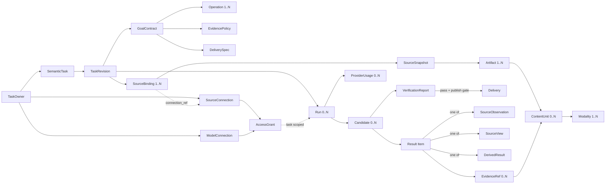

# Phase 4 D2：统一能力模型与领域契约

> 状态：已接受；用户于 2026-07-30 确认 D2，并授权进入 D3
> 日期：2026-07-30
> 对应 Issue：[GitHub #14](https://github.com/Eclipseic1848/Mangrove_platform/issues/14)
> 上游基线：[D1 当前状态与 Issue 对账](../research/2026-07-30-phase4-d1-current-state-issue-reconciliation.md)
> 本阶段性质：领域建模与架构规格，不实现代码、不迁移数据库、不切换默认入口。

## 1. 本轮结论

### 1.1 已验证事实

1. `SemanticTaskPlan` 把 `task_family` 设为必填字段，并在来源读取前保存大量完整任务语义；
   当前枚举把任务分为 extract、tabular_transform、compare 等互斥类别。
   Binder、文档 Planner 和 API 路由随后都用该字段排他分支。
   证据：`src/semantic_harness/models.py:32-42,289-311`、
   `src/semantic_harness/binder.py:143-156`、
   `src/semantic_harness/document_planner.py:157-236`、
   `src/api/routes/semantic_harness.py:77-85`。
2. 现有 Source Inspector 只把来源归为 `TABULAR` 或 `DOCUMENT`，且绑定目标只覆盖表格列、
   文档章节、文档元素和文档表格单元格。
   证据：`src/semantic_harness/inspection_models.py:30-39,85-113`。
3. `RawArtifact`、`ArtifactRef`、`EvidenceRef`、`CandidateArtifact` 和 `DeliveryManifest`
   已分别存在，但它们分散在数据准备、Phase 4A、Legacy Harness、vNext 和 Delivery
   包中，没有一份跨来源、跨模态的统一身份与关系契约。
4. Legacy 已有正式 Delivery；vNext 当前只生成 Candidate，并把
   `formal_delivery_eligible` 固定为 false。
   证据：`src/semantic_harness/delivery/models.py:22-65`、
   `src/agentic_runtime/models.py:116-175`。
5. `PiRuntimeRequest` 当前直接携带 `model`、`base_url` 和 `api_key`；这可以服务当前
   本地灰度，但不满足已确认的个人连接隔离、密钥不可进入任务记录和 Agent 环境的目标。
   证据：`src/agentic_runtime/models.py:70-93`。
6. 当前 `CONTEXT.md` 混入分支、Pi/Egress 实施状态，并把复合来源任务限定为“必须形成
   一个合并结果”；这与已经确认的比较、校验、补全、分别输出等语义冲突。
   证据：`CONTEXT.md:6-8,52-62,112-114`。

### 1.2 基于代码的判断

当前缺陷不是少一个新的 `TaskFamily`，而是把五个本应正交的维度压成了一个路由标签：

```text
来源通道 × 内容模态 × 任务操作 × 证据策略 × 交付形式
```

继续增加 `MEDIA`、`DATABASE` 或 `API` TaskFamily 会复制执行链，并再次使“PDF 内表格”、
“文档 + Excel 对比”和“API 返回音频”落入互斥路由。正确方向是让来源检查发现一个制品
包含的零到多个模态，再由同一个目标契约组合操作和验证。

### 1.3 已接受决策

1. `SemanticTask` 是用户看到的任务容器，`TaskRevision` 内唯一的 `GoalContract` 是
   不可变业务真相；动态执行草案不是业务真相。
2. `SourceBinding` 表达获准读取什么；`SourceSnapshot` 表达本次实际观察到什么；
   `Artifact` 表达系统中可按哈希重开的不可变内容。
3. `Modality` 属于制品内的 `ContentUnit`，不属于整个任务，也不决定唯一执行器。
4. `Operation` 表达用户要求的业务操作，不表达工具调用顺序。
5. 结果逐项标记为 `SourceObservation`、`SourceView` 或 `DerivedResult`。
6. Agent/工具只能生成 `Candidate`；独立 `Verifier` 产生验证结论；只有
   `DeliveryPublisher` 拥有正式发布权。
7. `TaskFamily` 在兼容期只能作为旧任务显示或遥测提示，不得继续选择 vNext 执行链。

## 2. 先纠正两个容易误导的词

### 2.1 用户所说的“openAPI”统一建模为模型连接

用户已澄清：这里的“openAPI”是其他模型 Provider 提供的 URL、模型名和 API Key，不是
业务数据 API。

**已确认的含义：**

- 至少需要 URL、模型名和用户自己的 API Key；
- 它不是业务数据 API。

**已确认的名称与首批协议边界：**

- 产品界面使用 **自定义模型 API**；
- 领域契约使用 `ModelConnection`；
- `base_url` 只是端点地址，连接另以 `api_format` 明确选择
  `anthropic_messages`、`openai_chat_completions`、`openai_responses` 或
  `gemini_generate_content`；
- 四种格式分别表示端点兼容 Anthropic Messages、OpenAI Chat Completions、
  OpenAI Responses API 或 Gemini Native `generateContent`；
- 每类连接都配置 `base_url`、`model` 和秘密引用；
- 连接保存前必须验证协议、模型可用性和最小推理调用；
- 不能把只兼容 OpenAI Chat Completions 的端点静默登记为 `openai_responses`；
- `api_format` 描述线上的请求/响应格式；“原生调用”或“经网关协议转换”是另一项
  连接能力，必须显式记录，不能由 URL 猜测；
- 其他格式必须增加专用请求、鉴权、错误和用量解析 Adapter，不能只凭 URL、模型名和
  Key 假装兼容；
- 业务数据接口仍称 **HTTP API 来源**，属于 `SourceBinding.channel=http_api`。

技术文档不继续用单独的“OpenAPI”表示模型连接，因为 OpenAPI 本身也是接口描述标准；
界面可使用用户更容易理解的“自定义模型 API”。

格式名称分别对应
[Anthropic Messages API](https://platform.claude.com/docs/en/api/messages)、
[OpenAI Chat Completions API](https://platform.openai.com/docs/api-reference/chat)、
[OpenAI Responses API](https://platform.openai.com/docs/api-reference/responses) 和
[Gemini `generateContent`](https://ai.google.dev/api/generate-content)；具体启用顺序、
原生或转换路线、鉴权、能力探测、秘密存储和外发治理由 D4 冻结。

### 2.2 “正式交付”不等于“来源事实”

正式交付描述的是发布权和质量状态，不代表交付中的每句话都是来源原文。用户可以明确要求
总结、翻译或分类，并把派生报告作为正式 Delivery；但每个派生项仍必须标记为
`DerivedResult`，不能冒充来源观察。

## 3. 已接受统一词汇表

以下词汇已由用户确认，并同步写入根目录 `CONTEXT.md`。

### 3.1 任务与所有权

**语义任务（SemanticTask）**
由任务所有者创建、用于组织不可变修订、执行、候选和正式交付的生命周期容器。

**任务修订（TaskRevision）**
一次已确认业务含义的不可变版本；来源范围、操作含义、连接/粒度、冲突策略或交付要求
发生实质变化时创建新修订。

**目标契约（GoalContract）**
任务修订中的业务真相，记录来源范围、所需操作、必须包含、明确不要、结果语义、证据策略、
交付要求和获准权限；不预先选择工具路线。

**执行运行（Run）**
针对一个任务修订的一次执行尝试；重试、恢复和重新规划属于 Run，不得改写目标契约。

**任务所有者（TaskOwner）**
拥有任务、来源授权、候选和交付访问权的用户；管理员治理权不自动等于内容使用权。

### 3.2 来源、制品与模态

**来源绑定（SourceBinding）**
任务获准读取的逻辑来源，包含来源通道、定位引用、选择范围、连接引用和读取上限，但不含
凭证明文。

**来源快照（SourceSnapshot）**
某次运行对来源绑定实际观察到的不可变身份，记录观察时间、查询/请求摘要、版本或哈希以及
产生的源制品；数据库/API 快照只覆盖本次获准读取的结果，不复制整个外部系统。

**制品（Artifact）**
系统中可通过身份和 SHA-256 重开的不可变内容；源文件、API 响应、数据库查询结果、
中间转换、候选文件和交付文件都是不同角色的制品。

**内容单元（ContentUnit）**
制品中可被选择、操作和引用的最小稳定地址，例如表/列/行、页/段落/单元格、JSON 节点、
图片区域、音频片段或视频帧。它只统一身份、模态和位置，不强迫所有内容进入一个巨型 AST。

**内容模态（Modality）**
内容单元的表达形态，例如结构化表格、文档文本、图片、音频、视频或归档；一个制品可以
同时含多个模态。

**复合来源任务（CompositeSourceTask）**
一个任务修订消费两个或更多逻辑来源或来源类别；结果可以是比较、校验、补全、连接、
分别输出或显式合并，不要求一定生成一个合并结果。

### 3.3 操作、结果与证据

**任务操作（Operation）**
用户要求施加在所选内容上的业务操作，例如提取、过滤、投影、连接、比较、OCR、转写、
转换、总结或翻译；它不等于工具或脚本步骤。

**结果项（ResultItem）**
候选或交付中可独立验证的一项结果，必须且只能标记为 SourceObservation、SourceView 或
DerivedResult 之一。

**来源观察（SourceObservation）**
从来源内容直接复制、确定性解析或经 OCR/ASR 等识别得到并绑定证据的结构化主张；它带
状态和置信度，不因被抽取就自动成为客观真相。

**来源视图（SourceView）**
对来源观察进行选择、排序、重排、格式转换或经用户明确连接后的结果，不增加新的业务判断。

**派生结果（DerivedResult）**
总结、改写、翻译、分类、观点或推断等新增语义；必须由用户明确要求、标记为派生并引用
支持证据。

**证据引用（EvidenceRef）**
把一项来源观察或派生依据指回来源快照、源制品和确定位置的不可变引用；包含引用内容或
哈希、提取器/工具版本和必要的置信信息。

**证据策略（EvidencePolicy）**
目标契约对证据覆盖率、位置精度、允许的不确定状态和复核要求的约束；它不指定具体解析器。

### 3.4 候选、验证与交付

**交付规格（DeliverySpec）**
目标契约对结果分类、格式、数量、命名、必须包含、明确不要和重开 QA 的要求；它不指定
Renderer 或转换器。

**候选（Candidate）**
一次 Run 生成、尚未正式发布的一组结果制品、结果分类、证据和血缘；验证通过也不自动
成为正式交付。

**验证报告（VerificationReport）**
独立于执行者，重新打开来源快照和候选后，对目标覆盖、语义、证据、格式、数量、所有权
和禁止项作出的结构化结论。

**正式交付（Delivery）**
通过发布门后面向任务所有者发布的不可变结果包；它引用唯一任务修订、候选、验证报告、
输出制品和 Manifest。

**任务档案（TaskArchive）**
随语义任务保留的权威生产记录，引用目标修订、来源身份、运行摘要、验证和交付身份；
它不是业务正文的第二份副本。

**精简审计记录（AuditTombstone）**
任务内容按生命周期策略物理清理后保留的最小身份记录，不含业务正文、凭证或可恢复内容。

### 3.5 连接与授权

**来源连接（SourceConnection）**
访问数据库、HTTP API 或其他受控来源的用户级或管理员级连接配置；任务只保存引用。

**模型连接（ModelConnection）**
用于推理的本地或远程模型配置，包含 API 格式、端点、模型、能力和秘密引用；已识别的
远程格式为 `anthropic_messages`、`openai_chat_completions`、`openai_responses` 和
`gemini_generate_content`。它不是业务数据来源。

**访问授权（AccessGrant）**
连接代理针对任务所有者、任务修订、用途和有效期签发的临时使用权；不向 Agent、任务、
事件、证据或 Delivery 暴露原始密钥。

**Provider 原生用量（ProviderUsage）**
模型 Provider 对一次调用返回的原生计量，例如输入/输出/总 Token、请求数或多媒体单位；
Provider 未返回时记录 unknown，不估算价格或生成计费账本。

## 4. 领域关系



关系约束：

1. 一个 TaskRevision 包含且只包含一个不可变 GoalContract。
2. 一个 SourceBinding 可以在不同 Run 形成不同 SourceSnapshot；每个 Run 必须冻结实际
   使用的快照身份。
3. 一个 Artifact 可以包含多个 Modality；Modality 不反向决定 TaskFamily。
4. Candidate 和 Delivery 都引用 Artifact，但二者发布权和用户语义不同。
5. EvidenceRef 必须最终落到 SourceSnapshot 中的 Artifact/ContentUnit，不能只指向中间
   摘要或模型回答。

## 5. 五轴契约

| 轴 | GoalContract 中保存什么 | 不保存什么 |
|---|---|---|
| 来源通道 | SourceBinding 引用、允许范围、只读限制、读取上限 | 密钥、宿主机任意路径、工具路线 |
| 内容模态 | 用户明确要求或检查后确认的目标模态/单元范围 | 整个任务唯一类型 |
| 任务操作 | 业务操作、输入关系、粒度、连接键、冲突策略、内容语义 | Python/Shell/SQL 步骤 |
| 证据策略 | 要求覆盖率、位置精度、允许的无法确定状态 | 用模型自信度代替证据 |
| 交付形式 | 结果分类、格式、数量、命名、必须包含/明确不要、QA 条件 | Renderer/转换器选择 |

### 5.1 来源通道首批闭集

首批进入 Phase 4 的 SourceBinding channel：

- `upload`：已有 ArtifactStore 中的用户上传；
- `remote_resource`：匿名 URL 或可直接读取的远程文件；
- `http_api`：现有只读 HTTP API；
- `database`：SQLite/MySQL/PostgreSQL 命名只读连接；
- `managed_path`：管理员批准的只读目录引用。

不进入本阶段：

- 任意宿主机绝对路径；
- 数据库/API 写入；
- 需要登录发现未知入口的认证浏览器流程；
- 实时摄像头、麦克风或直播流。

### 5.2 模态是检查结果，不是路由标签

建议最小模态枚举：

- `structured`：表、行、列、JSON 对象等结构化内容；
- `text`：段落、标题、字幕文本等；
- `image`；
- `audio`；
- `video`；
- `archive`：容器模态，解包后成员重新检查。

格式不是模态。PDF、DOCX、XLSX、MP4、ZIP 是制品格式；一个 PDF 可以同时包含 text、
structured 和 image。

### 5.3 操作与结果语义

| 操作示例 | 默认结果分类 | 必须确认的歧义 |
|---|---|---|
| 提取/OCR/ASR | SourceObservation | 范围、低置信度处理 |
| 过滤/投影/排序/格式转换 | SourceView | 字段、粒度、丢失风险 |
| 连接/合并/补全 | SourceView | 连接键、基数、粒度、冲突策略 |
| 比较/核查 | SourceView 或 DerivedResult，逐项标记 | 比较口径、冲突含义 |
| 总结/改写/翻译/分类/推断 | DerivedResult | 用户是否明确要求、允许的推断边界 |

## 6. 核心不变量

### 6.1 业务语义

1. 用户已确认的业务含义只存在于 TaskRevision 内的 GoalContract；执行草案、Prompt、
   工具参数和 Candidate 不能静默改写它。
2. 初始意图可以先形成目标提案，但在真实来源检查完成前不得冻结排他的物理执行路线。
3. 来源范围、连接键、记录粒度、冲突策略、结果分类或交付含义不明确时必须进入
   `NeedsUser`，不能猜测默认值。
4. 同一制品的不同模态可以被同一任务组合消费，不得要求用户拆成“文本任务”和
   “多媒体任务”。

### 6.2 来源与凭证

1. SourceBinding、GoalContract、Run、Event、Artifact、Evidence、Candidate 和 Delivery
   均不得包含 API Key、Cookie、密码或可还原秘密。
2. `managed_path` 只能引用管理员批准的目录 ID，不接受用户提交任意宿主路径。
3. API/数据库等可变来源必须形成本次读取的 SourceSnapshot；后续来源变化不能回写旧快照。
4. 用户自己的模型连接失败时，不得静默改用平台模型连接。
5. ProviderUsage 只记录 Provider 原生返回的用量；未知值必须显式为 unknown，不补价格、
   预算或计费推断。

### 6.3 结果与证据

1. 每项非空 SourceObservation 必须有 EvidenceRef。
2. SourceView 的每个输出记录必须能沿 lineage 回到全部参与来源。
3. DerivedResult 必须显式标记；证据引用只说明依据，不把推断变成来源事实。
4. 冲突默认保留各方值和各自证据；禁止 first-wins、last-wins 或模型静默裁决。
5. OCR/ASR/视觉模型输出是带置信度的来源观察，不能仅凭模型回答升级为确定事实。

### 6.4 候选、验证与发布

1. 执行者无正式发布权。
2. Verifier 必须从保存的来源快照和候选制品重新读取，不能只相信 Agent/工具摘要。
3. Candidate 验证通过仍不是 Delivery；只有 Publisher 可以创建
   `delivery_published + output_id`。
4. 取消、验证失败、来源身份失败、格式重开失败、所有权失败或发布中断必须产生零新
   Delivery。
5. Delivery 不可原地覆盖；修改业务含义或输出要求创建新 TaskRevision 和新 Delivery。

## 7. 失败关闭矩阵

| 条件 | 所属模块 | 结果 | 禁止行为 |
|---|---|---|---|
| 来源不存在、越权或无法建立身份 | SourceIntake | Blocked/Failed | 让 Agent 猜来源 |
| 损坏、加密、不支持或超限 | SourceIntake | NeedsUser/Failed | 当成空数据成功 |
| 检测到多模态 | SourceIntake | 返回全部 ContentUnit | 选一个 TaskFamily 丢弃其余模态 |
| 连接键、粒度或业务含义不明 | TaskDefinition | NeedsUser | 自动选择第一列/同名列 |
| 需要新外发目标或权限 | Policy/ConnectionBroker | NeedsUser/Denied | 静默外发或回退到平台 Key |
| 工具失败或输出为空 | TaskExecution | Observation + 有界重规划/失败 | 自报 completed |
| 证据缺失、错源或结果超范围 | CandidateVerification | Fail/NeedsUser | 进入正式发布 |
| 文件格式、数量或重开 QA 不符 | CandidateVerification | Fail | 静默换格式 |
| Publisher 原子发布中断 | DeliveryPublishing | Failed，零新 Delivery | 暴露半成品为正式下载 |

精确状态名、幂等键、重试次数和恢复转换由 D3 冻结；D2 只冻结状态所有权和失败关闭原则。

## 8. 深模块与 Interface

这里的 Module 是逻辑模块，不要求拆成微服务或独立进程。保持同进程实现完全允许；只有
权限、替换和测试需要时才设置 Seam。

### 8.1 TaskDefinition Module

**Interface**

```text
propose(intent, prior_revision?) -> GoalProposal
confirm(proposal, source_inventory, actor) -> TaskRevision | Clarification
```

**隐藏的复杂性**

- 用户语言解析、字段/粒度/结果语义检查；
- 多轮修订合并；
- 业务含义变化检测；
- 需要用户确认的问题生成。

**Seam 决策**

模型调用是内部 Seam；确定性验证和修订身份不能由模型 Adapter 决定。
如果来源检查没有发现会改变业务含义的歧义，用户的原始提交就是确认，不额外制造一次
无意义弹窗。

### 8.2 SourceIntake Module

**Interface**

```text
inspect(source_bindings, access_grants, limits) -> SourceInventory | IntakeFailure
```

**隐藏的复杂性**

- 上传、URL、HTTP API、数据库和受管目录读取；
- 格式探测、解包、Schema/页/Sheet/轨道检查；
- SourceSnapshot、Artifact 和 ContentUnit 身份；
- 来源越权、损坏、加密和超限失败关闭。

**Adapter**

每个已支持来源通道一个 Adapter；测试使用固定本地 Adapter。调用方不接触数据库驱动、
HTTP 分页或路径解析细节。

### 8.3 TaskExecution Module

**Interface**

```text
start(goal_revision, source_inventory, run_policy) -> RunHandle
resume(run_id, command?) -> RunOutcome
cancel(run_id, actor) -> CancelResult
```

**隐藏的复杂性**

- Observe/Plan/Act/Verify/Replan；
- Tool Catalog、任务环境、资源和网络治理；
- 执行草案、工具调用、Observation 和 Checkpoint；
- 候选制品、结果分类、Evidence 和 lineage 组装。

**内部 Seam**

`AgentKernel` 是 TaskExecution 内部的真实 Seam：已有 Pi 与 OpenCode 两个合理 Adapter。
业务调用方不应直接依赖 Pi RPC、容器路径或框架事件。

### 8.4 CandidateVerification Module

**Interface**

```text
verify(goal_revision, source_snapshot_set, candidate) -> VerificationReport
```

**隐藏的复杂性**

- 来源身份、目标语义、证据覆盖、结果分类、数量和格式 QA；
- 不同模态的独立读取器；
- 可修复、需用户和不可修复失败分类。

执行模块不能注入“自动通过” Adapter；测试通过固定来源/候选夹具走相同 Interface。

### 8.5 DeliveryPublishing Module

**Interface**

```text
publish(candidate, verification_report, delivery_spec, actor) -> Delivery | PublishFailure
resolve(delivery_id, actor) -> Delivery
```

**隐藏的复杂性**

- 原子 staging/publish；
- 输出重开、SHA、Manifest 和下载所有权；
- 零半成品、不可覆盖和版本保留。

正式发布能力只存在于该 Module，不能注册成 Agent 可调用的普通能力工具。

### 8.6 ConnectionBroker Module

**Interface**

```text
verify_connection(connection_draft, actor) -> ConnectionStatus
grant(connection_ref, task_revision, purpose, actor) -> AccessGrant | Denied
```

**隐藏的复杂性**

- 密钥加密静态存储和解密；
- 用户本人和管理员各自可见的脱敏元数据与状态；
- endpoint/model/capability 连通验证；
- 四类 API 格式的请求、错误和 Provider 原生用量归一；
- 短期凭证代理、撤销和原生用量关联。

连通验证不得携带任务业务内容；仅发送 Provider 允许的最小无敏探针。

D4 冻结该 Module 的权限、秘密和外发细节；D2 只确定业务模块不得接收原始 Key。

## 9. 为什么这不是“过重设计”

1. 这些是六个逻辑 Module，不是六个部署单元。
2. `ContentUnit` 只统一引用，不建立吞掉所有格式的巨型数据对象。
3. 来源和模型的 Adapter 只放在确实存在多个实现的 Seam。
4. 表格、文档、图片、音频和视频不各自复制任务状态机、Verifier 和 Publisher。
5. 现有 Legacy 契约通过 Adapter 兼容，不要求一次性重写。

删除测试：

- 删除 SourceIntake，URL/API/数据库/文件检查复杂性会泄漏到每个执行器和 Verifier；
- 删除 CandidateVerification，执行者会重新拥有自证成功权；
- 删除 DeliveryPublishing，发布、QA 和所有权逻辑会散落在每个 Renderer；
- 因此三者具有足够 Depth，不是简单透传。

## 10. 现有契约兼容映射

| 现有契约 | 拟议归属 | 兼容策略 | D2 后续动作 |
|---|---|---|---|
| `data_prep.SourceSpec` | SourceBinding | 保留读取 Adapter，禁止秘密进入任务 | 增加 channel/connection_ref/scope 映射 |
| `RawArtifact` / `ArtifactRef` | Artifact + SourceSnapshot | 保留 ID/SHA/大小；补角色和快照身份 | 不迁移原文件 |
| `RecordEnvelope` | ContentUnit/SourceObservation 的结构化实现 | 继续作为表格记录载体 | 不强迫文档/媒体转成行 |
| `DocumentElement` / `TableProfile` / `DocumentTarget` | ContentUnit 的模态实现 | 保留各自深结构，只统一引用信封 | 扩展图片/音频/视频 locator |
| `TaskGoal` + `ExtractionSpec` + `ResultContract` | GoalContract Adapter | 旧任务原样读取 | 新修订转为统一契约 |
| `SemanticTaskPlan` | Legacy Goal/Plan 兼容载体 | Legacy 保留；vNext 不以其锁定执行链 | 拆出业务语义与执行草案 |
| `TaskFamily` | 旧显示/遥测提示 | 不删除旧枚举，不再路由 vNext | 新代码不得增加模态/来源 family |
| `SourceKind.TABULAR/DOCUMENT` | Modality 检查结果 | Legacy Inspector 保留 | 新 SourceInventory 支持多模态集合 |
| `CombineSpec.PRESERVE/ONE_TABLE` | Operation 的关系语义 | 旧值映射 preserve/explicit_merge | 增加 compare/join/fill/separate |
| `BoundPlan` | 绑定快照兼容载体 | 可由 SourceInventory + GoalContract 生成 | 不再是唯一执行入口 |
| `CapabilityManifest` | TaskExecution 内部 Tool Descriptor | 保留 Schema/副作用/网络/资源声明 | 补模态和证据能力 |
| `ToolResult` | Observation + Artifact/lineage | 保留失败关闭和账本 | 不作为正式结果 |
| `CandidateArtifact` | Candidate.artifacts | 保留 owner 下载和 QA | Candidate 增加 goal/evidence/result class |
| vNext `VerificationReport` | VerificationReport | 保留独立验证和 false 发布资格 | 与 Legacy 检查项统一但不自动发布 |
| Legacy `DeliveryManifest` | Delivery | 作为首个正式 Publisher 契约 | vNext 复用发布门，不复制第二套 Delivery |
| `PiRuntimeRequest.model/base_url/api_key` | ModelConnectionRef + AccessGrant | 当前灰度兼容 | D4 禁止新契约透传原始 Key |

兼容原则：

- 不迁移或改写旧任务、旧 Evidence、旧 Delivery；
- 只在新 revision 使用新契约；
- Legacy/vNext 双轨期间由 Adapter 转换，用户可回退；
- 映射失败必须显式暂停，禁止丢字段后继续执行。

## 11. 场景压力测试

### 11.1 PDF 附件表格只输出 CSV

```text
SourceBinding(upload)
→ SourceSnapshot(PDF)
→ ContentUnit(text + structured + image)
→ Operation(extract selected table, project columns)
→ SourceView(CSV)
→ EvidenceRef(page/table/cell)
→ Candidate → Verification → Delivery
```

PDF 是格式，表格是模态。无需创建“文档转表格 TaskFamily”。

### 11.2 Word 与 Excel 对比

两个 SourceBinding 分别产生文档文本单元和结构化单元。Operation 是 compare，不默认
merge；双方冲突分别保留 EvidenceRef。比较口径或记录粒度不明时进入 NeedsUser。

### 11.3 HTTP API 返回音频 URL 后转写

HTTP API 是来源通道；响应 JSON 与它引用的音频是两个关联 Artifact。音频转写产生带时间
位置的 SourceObservation。模型连接只参与识别/校验，不变成业务来源。

### 11.4 数据库记录与 PDF 条款补全

在用户明确主键、记录粒度和允许补全字段前不得连接。确认后，数据库行与 PDF 条款分别
保留来源身份；补全结果是 SourceView，并记录每个字段来自哪一方。冲突不得静默覆盖。

### 11.5 用户要求“总结并输出正式 PDF”

Operation 明确为 summarize，结果逐项标记 DerivedResult，引用支持 Evidence；格式 PDF
只是 DeliverySpec。独立 Verifier 检查遗漏、超范围和错误引用，发布后它是正式 Delivery，
但不是“来源原文”。

## 12. D2 与后续决策边界

| 后续任务 | D2 提供的输入 | D2 不提前决定 |
|---|---|---|
| D3 vNext Delivery/默认状态机 | Candidate/Verifier/Publisher 权限边界 | 精确状态名、重试、幂等和切换步骤 |
| D4 外部服务/个人 Key | ModelConnection/AccessGrant/ConnectionBroker | 加密方案、管理员页面、代理协议 |
| D5/D6 多媒体 | Modality/ContentUnit/EvidenceRef | 工具胜出者和实际资源阈值 |
| D7 复合来源 | SourceBinding/Operation/冲突不变量 | 各连接算法与产品交互细节 |
| D8 工作台 | 任务、修订、候选、交付的稳定语言 | 页面布局和新手引导交互 |
| D9 生命周期 | Artifact/TaskArchive/AuditTombstone 身份 | 物理删除任务和定时器实现 |
| D10 生产门 | 五轴覆盖和模块 Interface | 冻结语料内容及阈值执行细节 |

## 13. D2 确认记录

用户于 2026-07-30 接受以下决策：

1. 接受本文件中的统一词汇、关系和不变量；
2. 接受 `TaskFamily` 只保留 Legacy 兼容，不再用于 vNext 路由；
3. 接受六个逻辑深 Module，但不要求拆微服务；
4. 接受 Legacy `DeliveryManifest` 是统一正式交付的首个实现，vNext 复用发布门；
5. 接受 `ContentUnit` 只是跨模态引用信封，不建立巨型统一 AST；
6. 接受产品界面使用“自定义模型 API”，领域契约使用 `ModelConnection`；
7. 模型连接以独立 `api_format` 区分 `anthropic_messages`、
   `openai_chat_completions`、`openai_responses` 和 `gemini_generate_content`，
   并与 `base_url` 分开配置；D4 决定首批启用及协议转换边界。

同步动作：

- 将统一词汇同步到根目录 `CONTEXT.md`；
- 将 ADR-0018 标记为 `accepted`；
- 在 ADR-0012/0017 记录被部分取代关系；
- 更新并关闭 GitHub #14；
- 用户已在同一确认中明确授权进入 D3。

## 14. 本阶段明确不做

- 不实现 Schema、数据库迁移、Adapter 或 Runtime；
- 不修改现有任务和正式 Delivery；
- 不启用新的来源、模态、权限或外部模型；
- 不关闭 Legacy；
- 不修改默认入口；
- 不创建版本、标签、提交或外部发布。
